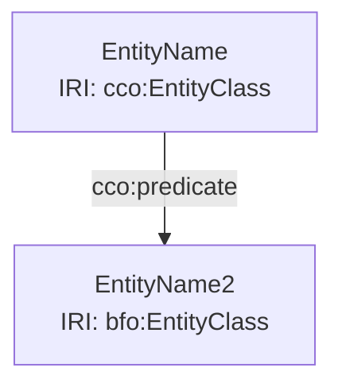

# OntoGrade Test Fixtures

**Purpose:** Comprehensive test cases for OntoGrade validation
**Location:** `/unit-tests/fixtures/ontograde/`

---

## Test Files Overview

| File | Purpose | Expected Score | Notes |
|------|---------|---------------|-------|
| `person_pass.mmd` | Perfect model | 5.0/5.0 | All patterns correct |
| `person_fail.mmd` | Multiple violations | ~2.0/5.0 | 7 distinct errors |
| `valid-simple.mmd` | Basic valid model | 5.0/5.0 | Minimal example |
| `valid-complex.mmd` | Advanced patterns | 5.0/5.0 | Multi-pattern |
| `invalid-orphan.mmd` | BFO rooting failure | ~1.5/5.0 | No BFO root |
| `invalid-wrong-predicate.mmd` | CCO violation | ~3.0/5.0 | Wrong predicate |
| `invalid-empty.mmd` | Parse error | 0.0/5.0 | Empty diagram |

---

## Detailed Test Cases

### ✅ person_pass.mmd - Perfect Model

**Entities:**
- 2 Independent Continuants: Person, House
- 1 Dependent Continuant: ResidentRole
- 2 Processes: ActOfOccupancy, TemporalInterval
- 4 Information Entities: 2 ICE + 2 IBE

**Patterns Demonstrated:**
1. ✅ **Role Pattern** (CCO)
   - `Person -->|is_bearer_of| ResidentRole`
   - `ActOfOccupancy -->|realizes| ResidentRole`

2. ✅ **Designation Pattern** (CCO)
   - `Person -->|is_designated_by| PersonName`
   - `House -->|is_designated_by| PostalAddress`

3. ✅ **Information Staircase** (CCO)
   - `PersonName -->|is_concretized_by| PersonNameRecord`
   - `PersonNameRecord -->|has_text_value| literal`

4. ✅ **Inverse Relations** (for querying)
   - `PersonName -->|designates| Person`
   - `PostalAddress -->|designates| House`

**Expected Results:**
- BFO Compliance: 100% (all entities rooted in BFO)
- Logic Integrity: 100% (no type collisions)
- CCO Best Practices: 100% (all patterns satisfied)
- **Final Score: 5.0/5.0**

**RDF Output:**
- 34 triples total
- All entities properly typed
- All predicates valid CCO/BFO properties

---

### ❌ person_fail.mmd - Multiple Violations

**Errors Introduced:**

#### Error 1: Wrong Role Pattern Predicate
```mermaid
Person_0 -->|has_role| Role_0  ❌ WRONG
```
**Should be:**
```mermaid
Person_0 -->|is_bearer_of| Role_0  ✅ CORRECT
```
**Violation:** CCO Role Pattern - incorrect predicate

---

#### Error 2: Missing Realization Link
```mermaid
%% MISSING: Occupancy_0 -->|realizes| Role_0
```
**Violation:** CCO Role Pattern - incomplete pattern

---

#### Error 3: Wrong Designation Predicate
```mermaid
Person_0 -->|has_name| Name_ICE  ❌ WRONG
```
**Should be:**
```mermaid
Person_0 -->|is_designated_by| Name_ICE  ✅ CORRECT
```
**Violation:** CCO Designation Pattern - incorrect predicate

---

#### Error 4: Wrong Information Staircase Predicate
```mermaid
Name_ICE -->|inheres_in| Name_IBE  ❌ WRONG
```
**Should be:**
```mermaid
Name_ICE -->|is_concretized_by| Name_IBE  ✅ CORRECT
```
**Violation:** CCO Information Staircase - incorrect predicate

---

#### Error 5: Missing Concretization Link
```mermaid
%% MISSING: Addr_ICE -->|is_concretized_by| Addr_IBE
```
**Violation:** CCO Information Staircase - incomplete pattern

---

#### Error 6: Missing Inverse Designation
```mermaid
%% MISSING: Name_ICE -->|designates| Person_0
%% MISSING: Addr_ICE -->|designates| House_0
```
**Violation:** CCO Best Practice - missing inverse relations

---

#### Error 7: Orphan Entity
```mermaid
CustomThing_0["MyCustomThing<br>IRI: ex:MyCustomThing"]
```
**Violation:** BFO Rooting - entity not rooted in BFO taxonomy

---

**Expected Results:**
- BFO Compliance: ~85% (1 orphan out of ~11 entities)
- Logic Integrity: ~90% (minor inconsistencies)
- CCO Best Practices: ~40% (6 violations out of 10 patterns)
- **Final Score: ~2.0/5.0**

**Expected Violation Report:**
```json
{
  "violations": [
    {
      "type": "SHACL",
      "pattern": "RolePattern",
      "description": "Wrong predicate 'has_role', expected 'is_bearer_of'",
      "entity": "Person_0",
      "severity": "error"
    },
    {
      "type": "SHACL",
      "pattern": "RolePattern",
      "description": "Missing realization link from Process to Role",
      "entity": "Occupancy_0",
      "severity": "error"
    },
    {
      "type": "SHACL",
      "pattern": "DesignationPattern",
      "description": "Wrong predicate 'has_name', expected 'is_designated_by'",
      "entity": "Person_0",
      "severity": "error"
    },
    {
      "type": "SHACL",
      "pattern": "InformationStaircase",
      "description": "Wrong predicate 'inheres_in', expected 'is_concretized_by'",
      "entity": "Name_ICE",
      "severity": "error"
    },
    {
      "type": "SHACL",
      "pattern": "InformationStaircase",
      "description": "Missing concretization link",
      "entity": "Addr_ICE",
      "severity": "error"
    },
    {
      "type": "SHACL",
      "pattern": "DesignationPattern",
      "description": "Missing inverse 'designates' link",
      "entity": "Name_ICE",
      "severity": "warning"
    },
    {
      "type": "BFO",
      "pattern": "Rooting",
      "description": "Entity not rooted in BFO taxonomy",
      "entity": "CustomThing_0",
      "severity": "error"
    }
  ]
}
```

---

## Usage in Tests

### Iteration 1 Tests (Current)
```javascript
import fs from 'fs';
import { mermaidLifter } from '../../../src/concepts/ontograde/mermaidLifter.js';

test('person_pass.mmd should parse correctly', () => {
  const diagram = fs.readFileSync(
    'unit-tests/fixtures/ontograde/person_pass.mmd',
    'utf8'
  );

  const store = mermaidLifter.helpers.liftToRDF(diagram);

  assert.strictEqual(store.size, 34, 'Should have 34 triples');
});

test('person_fail.mmd should parse but with violations', () => {
  const diagram = fs.readFileSync(
    'unit-tests/fixtures/ontograde/person_fail.mmd',
    'utf8'
  );

  const store = mermaidLifter.helpers.liftToRDF(diagram);

  // Still parses successfully (Iteration 1)
  assert.ok(store.size > 0, 'Should parse into RDF');

  // Violations will be detected in Iteration 2+
});
```

### Iteration 2 Tests (BFO Validation)
```javascript
test('person_pass.mmd should have all entities rooted', () => {
  const diagram = fs.readFileSync(
    'unit-tests/fixtures/ontograde/person_pass.mmd',
    'utf8'
  );

  const store = mermaidLifter.helpers.liftToRDF(diagram);
  const result = bfoValidator.helpers.performValidation(store);

  assert.strictEqual(result.orphans.length, 0, 'No orphan entities');
  assert.strictEqual(result.complianceScore, 1.0, 'Full BFO compliance');
});

test('person_fail.mmd should detect orphan entity', () => {
  const diagram = fs.readFileSync(
    'unit-tests/fixtures/ontograde/person_fail.mmd',
    'utf8'
  );

  const store = mermaidLifter.helpers.liftToRDF(diagram);
  const result = bfoValidator.helpers.performValidation(store);

  assert.ok(result.orphans.length > 0, 'Should detect orphans');
  assert.ok(
    result.orphans.some(o => o.includes('CustomThing')),
    'Should identify CustomThing as orphan'
  );
});
```

### Iteration 3 Tests (SHACL Validation)
```javascript
test('person_pass.mmd should pass all SHACL patterns', () => {
  const diagram = fs.readFileSync(
    'unit-tests/fixtures/ontograde/person_pass.mmd',
    'utf8'
  );

  const store = mermaidLifter.helpers.liftToRDF(diagram);
  const result = shaclValidator.helpers.validatePatterns(store);

  assert.strictEqual(result.violations.length, 0, 'No SHACL violations');
  assert.strictEqual(result.complianceScore, 1.0, 'Full pattern compliance');
});

test('person_fail.mmd should detect multiple SHACL violations', () => {
  const diagram = fs.readFileSync(
    'unit-tests/fixtures/ontograde/person_fail.mmd',
    'utf8'
  );

  const store = mermaidLifter.helpers.liftToRDF(diagram);
  const result = shaclValidator.helpers.validatePatterns(store);

  assert.ok(result.violations.length >= 6, 'Should detect at least 6 violations');

  // Verify specific violations
  const violationTypes = result.violations.map(v => v.pattern);
  assert.ok(violationTypes.includes('RolePattern'), 'Detect Role Pattern violation');
  assert.ok(violationTypes.includes('DesignationPattern'), 'Detect Designation violation');
  assert.ok(violationTypes.includes('InformationStaircase'), 'Detect Staircase violation');
});
```

---

## Manual Testing

### In the IDE

1. **Load person_pass.mmd**
   - Click "🎓 OntoGrade"
   - Expected: "Diagram parsed successfully. Found 34 RDF triples."
   - Future: Score 5.0/5.0

2. **Load person_fail.mmd**
   - Click "🎓 OntoGrade"
   - Expected: "Diagram parsed successfully. Found ~30 RDF triples."
   - Future: Score ~2.0/5.0, 7 violations listed

---

## Adding New Test Cases

### Template for New Fixtures



### Naming Convention

- `{domain}_pass.mmd` - Perfect example
- `{domain}_fail.mmd` - Multiple violations
- `{domain}_{pattern}_pass.mmd` - Specific pattern test
- `{domain}_{pattern}_fail.mmd` - Specific pattern violation

**Examples:**
- `organization_pass.mmd` - Perfect org model
- `organization_fail.mmd` - Org model with errors
- `organization_role_fail.mmd` - Only role pattern violated

---

## Validation Criteria Reference

### BFO Rooting (30% of score)
- ✅ All entities must trace to `bfo:Entity`
- ✅ Valid root classes:
  - `bfo:Continuant` (objects, qualities, roles)
  - `bfo:Occurrent` (processes, events)

### CCO Patterns (30% of score)

**Role Pattern:**
```mermaid
Object -->|is_bearer_of| Role
Process -->|realizes| Role
```

**Designation Pattern:**
```mermaid
Entity -->|is_designated_by| ICE
ICE -->|designates| Entity
```

**Information Staircase:**
```mermaid
ICE -->|is_concretized_by| IBE
IBE -->|has_text_value| Literal
```

### Logic Integrity (40% of score)
- ✅ No type collisions (entity can't be both Process and Object)
- ✅ No disjointness violations
- ✅ Consistent use of predicates

---

## Related Documentation

- [Functional Requirements](functionalRequirements.md) - Pattern definitions
- [Development Guide](developmentGuide.md) - Implementation details
- [Iteration 1 Complete](ITERATION1-COMPLETE.md) - Current status

---

**Last Updated:** January 8, 2026
**Status:** Ready for Iteration 2+ testing
