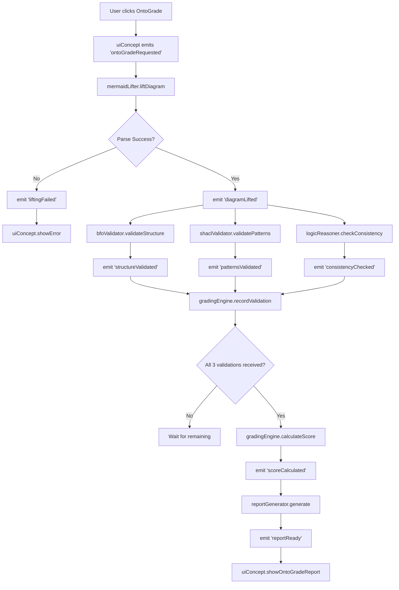
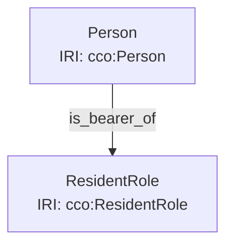
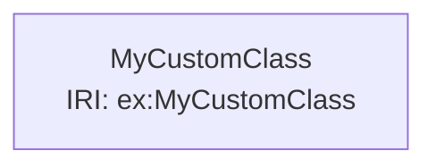
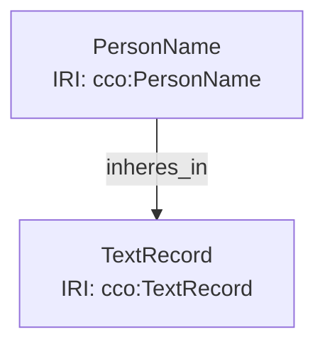

# OntoGrade Development Guide

**Version:** 1.0
**Date:** January 8, 2026
**Purpose:** Practical implementation guide for OntoGrade module development

---

## Table of Contents
1. [Architecture Patterns](#architecture-patterns)
2. [Integration Points](#integration-points)
3. [Data Flow](#data-flow)
4. [Concept Templates](#concept-templates)
5. [Testing Strategy](#testing-strategy)
6. [Error Handling](#error-handling)
7. [Dependencies](#dependencies)
8. [Performance Considerations](#performance-considerations)

---

## 1. Architecture Patterns

### Concept Structure Template

All OntoGrade concepts must follow this exact structure:

```javascript
/**
 * @module conceptName
 * @description Brief description of what this concept manages
 */

const subscribers = new Set();

/**
 * Notifies all subscribed listeners of an event.
 * @param {string} event - The name of the event.
 * @param {*} payload - The data associated with the event.
 */
function notify(event, payload) {
  for (const subscriber of subscribers) {
    subscriber(event, payload);
  }
}

export const conceptName = {
  state: {
    // Concept-specific state properties
    // Example: rdfGraph: null, errors: []
  },

  actions: {
    /**
     * Action description
     * @param {Object} params - Parameters
     */
    actionName(params) {
      // Pure logic - no direct DOM manipulation
      // Update state
      conceptName.state.someProperty = newValue;

      // Emit events for other concepts to react
      notify('eventName', payload);
    },
  },

  subscribe(fn) {
    subscribers.add(fn);
  },

  unsubscribe(fn) {
    subscribers.delete(fn);
  },

  notify, // Expose for testing
};
```

### Synchronization Registration Pattern

Add OntoGrade synchronizations to `/src/synchronizations.js`:

```javascript
// Add to imports section
import { mermaidLifter } from './concepts/ontograde/mermaidLifter.js';
import { bfoValidator } from './concepts/ontograde/bfoValidator.js';
import { shaclValidator } from './concepts/ontograde/shaclValidator.js';
import { logicReasoner } from './concepts/ontograde/logicReasoner.js';
import { gradingEngine } from './concepts/ontograde/gradingEngine.js';
import { reportGenerator } from './concepts/ontograde/reportGenerator.js';

// Add to synchronizations array
export const synchronizations = [
  // ... existing synchronizations ...

  // OntoGrade: Trigger evaluation when user clicks "OntoGrade" button
  {
    when: 'ontoGradeRequested',
    from: uiConcept,
    do: () => {
      console.log('[Sync] OntoGrade evaluation requested');
      const activeDiagram = diagramConcept.state.activeDiagram;
      if (activeDiagram && activeDiagram.content) {
        mermaidLifter.actions.liftDiagram({
          diagramId: activeDiagram.id,
          mermaidText: activeDiagram.content
        });
      } else {
        uiConcept.actions.showError('No active diagram to evaluate');
      }
    },
  },

  // OntoGrade: When diagram is lifted, trigger validators in parallel
  {
    when: 'diagramLifted',
    from: mermaidLifter,
    do: ({ diagramId, rdfGraph }) => {
      console.log('[Sync] Diagram lifted, starting validation...');
      bfoValidator.actions.validateStructure({ diagramId, rdfGraph });
      shaclValidator.actions.validatePatterns({ diagramId, rdfGraph });
      logicReasoner.actions.checkConsistency({ diagramId, rdfGraph });
    },
  },

  // OntoGrade: Handle lifting failures
  {
    when: 'liftingFailed',
    from: mermaidLifter,
    do: ({ error }) => {
      console.error('[Sync] Mermaid lifting failed:', error);
      uiConcept.actions.showError(`Failed to parse diagram: ${error.message}`);
    },
  },

  // OntoGrade: When all validations complete, calculate score
  {
    when: 'structureValidated',
    from: bfoValidator,
    do: ({ diagramId, result }) => {
      gradingEngine.actions.recordValidation({ diagramId, type: 'bfo', result });
    },
  },
  {
    when: 'patternsValidated',
    from: shaclValidator,
    do: ({ diagramId, result }) => {
      gradingEngine.actions.recordValidation({ diagramId, type: 'shacl', result });
    },
  },
  {
    when: 'consistencyChecked',
    from: logicReasoner,
    do: ({ diagramId, result }) => {
      gradingEngine.actions.recordValidation({ diagramId, type: 'logic', result });
    },
  },

  // OntoGrade: When score is calculated, generate report
  {
    when: 'scoreCalculated',
    from: gradingEngine,
    do: ({ diagramId, scoreData }) => {
      reportGenerator.actions.generate({ diagramId, scoreData });
    },
  },

  // OntoGrade: Display final report to user
  {
    when: 'reportReady',
    from: reportGenerator,
    do: ({ report }) => {
      console.log('[Sync] OntoGrade report ready');
      uiConcept.actions.showOntoGradeReport(report);
    },
  },
];
```

---

## 2. Integration Points

### Hooking into Existing Diagram State

OntoGrade will read from `diagramConcept.state.activeDiagram`:

```javascript
// In UI button click handler
document.getElementById('ontograde-btn').addEventListener('click', () => {
  const activeDiagram = diagramConcept.state.activeDiagram;

  if (!activeDiagram) {
    alert('Please select a diagram first');
    return;
  }

  // Emit event that synchronizations will handle
  uiConcept.notify('ontoGradeRequested', { diagramId: activeDiagram.id });
});
```

### UI Components to Add

**Location:** `/src/ui/` (or inline in `index.html` if simple)

1. **OntoGrade Button** - Add to toolbar next to Save/Delete
2. **OntoGrade Modal** - Display results with:
   - Overall score (large, prominent)
   - Breakdown by dimension (BFO/Logic/CCO)
   - Violations list (expandable)
   - Recommendations
   - Download JSON-LD button

**Suggested HTML structure:**

```html
<!-- Add to toolbar in index.html -->
<button id="ontograde-btn" class="btn" title="Evaluate Ontology">
  🎓 OntoGrade
</button>

<!-- Add modal template -->
<div id="ontograde-modal" class="modal" style="display: none;">
  <div class="modal-content">
    <span class="close">&times;</span>
    <h2>OntoGrade Report</h2>

    <div class="score-display">
      <div class="score-circle">
        <span id="final-score">0.0</span>
        <span class="score-max">/5.0</span>
      </div>
    </div>

    <div class="score-breakdown">
      <div class="dimension">
        <h3>BFO Compliance (30%)</h3>
        <div class="score-bar"><span id="bfo-score"></span></div>
        <p id="bfo-status"></p>
      </div>
      <div class="dimension">
        <h3>Logic Integrity (40%)</h3>
        <div class="score-bar"><span id="logic-score"></span></div>
        <p id="logic-status"></p>
      </div>
      <div class="dimension">
        <h3>CCO Best Practices (30%)</h3>
        <div class="score-bar"><span id="cco-score"></span></div>
        <p id="cco-status"></p>
      </div>
    </div>

    <div class="violations-section">
      <h3>Violations</h3>
      <ul id="violations-list"></ul>
    </div>

    <div class="recommendations-section">
      <h3>Recommendations</h3>
      <ul id="recommendations-list"></ul>
    </div>

    <div class="modal-actions">
      <button id="download-report-btn">Download JSON-LD</button>
      <button id="close-modal-btn">Close</button>
    </div>
  </div>
</div>
```

---

## 3. Data Flow

### Complete Evaluation Flow Diagram



### State Coordination in gradingEngine

The `gradingEngine` needs to coordinate multiple async validators:

```javascript
export const gradingEngine = {
  state: {
    // Track pending evaluations by diagramId
    pendingEvaluations: new Map(), // diagramId -> { bfo, shacl, logic }
    finalScores: new Map(), // diagramId -> scoreData
  },

  actions: {
    recordValidation({ diagramId, type, result }) {
      // Initialize if this is the first validation for this diagram
      if (!gradingEngine.state.pendingEvaluations.has(diagramId)) {
        gradingEngine.state.pendingEvaluations.set(diagramId, {
          bfo: null,
          shacl: null,
          logic: null,
          timestamp: Date.now(),
        });
      }

      const pending = gradingEngine.state.pendingEvaluations.get(diagramId);
      pending[type] = result;

      // Check if all three validations are complete
      if (pending.bfo && pending.shacl && pending.logic) {
        console.log('[gradingEngine] All validations complete, calculating score...');
        gradingEngine.actions.calculateScore({ diagramId, validations: pending });
      }
    },

    calculateScore({ diagramId, validations }) {
      const weights = { bfo: 0.3, logic: 0.4, shacl: 0.3 };

      // Calculate weighted score
      const bfoScore = validations.bfo.complianceScore; // 0-1
      const logicScore = validations.logic.integrityScore; // 0-1
      const shaclScore = validations.shacl.complianceScore; // 0-1

      const finalScore = (
        bfoScore * weights.bfo +
        logicScore * weights.logic +
        shaclScore * weights.shacl
      ) * 5.0; // Scale to 0-5

      const scoreData = {
        diagramId,
        finalScore,
        breakdown: {
          bfo: { score: bfoScore, weight: weights.bfo, details: validations.bfo },
          logic: { score: logicScore, weight: weights.logic, details: validations.logic },
          shacl: { score: shaclScore, weight: weights.shacl, details: validations.shacl },
        },
        timestamp: new Date().toISOString(),
      };

      gradingEngine.state.finalScores.set(diagramId, scoreData);
      gradingEngine.state.pendingEvaluations.delete(diagramId);

      notify('scoreCalculated', { diagramId, scoreData });
    },
  },

  subscribe(fn) { subscribers.add(fn); },
  unsubscribe(fn) { subscribers.delete(fn); },
  notify,
};
```

---

## 4. Concept Templates

### Example: mermaidLifter.js (Complete Implementation Template)

```javascript
/**
 * @module mermaidLifter
 * @description Parses Mermaid diagram syntax and converts to RDF triples
 */

import { Parser, Store, Writer } from 'n3';

const subscribers = new Set();

function notify(event, payload) {
  for (const subscriber of subscribers) {
    subscriber(event, payload);
  }
}

export const mermaidLifter = {
  state: {
    rdfGraphs: new Map(), // diagramId -> RDF graph (N3 Store)
    errors: new Map(), // diagramId -> error details
  },

  actions: {
    /**
     * Lifts a Mermaid diagram to RDF triples
     * @param {Object} params
     * @param {string} params.diagramId - Diagram identifier
     * @param {string} params.mermaidText - Mermaid diagram source
     */
    liftDiagram({ diagramId, mermaidText }) {
      try {
        console.log(`[mermaidLifter] Lifting diagram ${diagramId}...`);

        const rdfGraph = mermaidLifter.helpers.liftToRDF(mermaidText);

        mermaidLifter.state.rdfGraphs.set(diagramId, rdfGraph);
        mermaidLifter.state.errors.delete(diagramId);

        notify('diagramLifted', { diagramId, rdfGraph });
      } catch (error) {
        console.error(`[mermaidLifter] Lifting failed:`, error);

        mermaidLifter.state.errors.set(diagramId, {
          message: error.message,
          timestamp: Date.now(),
        });

        notify('liftingFailed', { diagramId, error });
      }
    },
  },

  helpers: {
    /**
     * Pure function: Converts Mermaid syntax to N3 RDF Store
     * @param {string} mermaidText - Mermaid diagram source
     * @returns {Store} N3 Store with RDF triples
     */
    liftToRDF(mermaidText) {
      const store = new Store();

      // Parse Mermaid syntax
      const lines = mermaidText.split('\n').filter(l => l.trim());

      // Skip first line if it's "graph TD" or similar
      const dataLines = lines[0].match(/^graph\s+(TD|LR|TB|RL)/)
        ? lines.slice(1)
        : lines;

      for (const line of dataLines) {
        // Node definition: Person_0["Person<br>IRI: cco:Person"]
        const nodeMatch = line.match(/(\w+)\["([^"]+)"\]/);
        if (nodeMatch) {
          const [, nodeId, label] = nodeMatch;

          // Extract IRI from label
          const iriMatch = label.match(/IRI:\s*(\S+)/);
          const iri = iriMatch ? iriMatch[1] : `ex:${nodeId}`;

          // Extract type from label (first line before <br>)
          const type = label.split('<br>')[0].trim();

          store.addQuad(
            `ex:${nodeId}`,
            'rdf:type',
            iri
          );

          store.addQuad(
            `ex:${nodeId}`,
            'rdfs:label',
            `"${type}"`
          );
        }

        // Edge definition: Person_0 -->|is_bearer_of| Role_0
        const edgeMatch = line.match(/(\w+)\s*-->\s*\|([^|]+)\|\s*(\w+)/);
        if (edgeMatch) {
          const [, subject, predicate, object] = edgeMatch;

          store.addQuad(
            `ex:${subject}`,
            `cco:${predicate}`,
            `ex:${object}`
          );
        }
      }

      // Validate that store is not empty
      if (store.size === 0) {
        throw new Error('No valid nodes or edges found in Mermaid diagram');
      }

      return store;
    },
  },

  subscribe(fn) { subscribers.add(fn); },
  unsubscribe(fn) { subscribers.delete(fn); },
  notify,
};
```

### Example: bfoValidator.js (Structure Template)

```javascript
/**
 * @module bfoValidator
 * @description Validates BFO rooting and structural alignment
 */

const subscribers = new Set();

function notify(event, payload) {
  for (const subscriber of subscribers) {
    subscriber(event, payload);
  }
}

export const bfoValidator = {
  state: {
    validationResults: new Map(), // diagramId -> validation result
  },

  actions: {
    validateStructure({ diagramId, rdfGraph }) {
      console.log(`[bfoValidator] Validating structure for ${diagramId}...`);

      try {
        const result = bfoValidator.helpers.performValidation(rdfGraph);

        bfoValidator.state.validationResults.set(diagramId, result);

        notify('structureValidated', { diagramId, result });
      } catch (error) {
        console.error('[bfoValidator] Validation error:', error);

        const errorResult = {
          complianceScore: 0,
          orphans: [],
          error: error.message,
        };

        notify('structureValidated', { diagramId, result: errorResult });
      }
    },
  },

  helpers: {
    /**
     * Pure function: Performs BFO rooting validation
     * @param {Store} rdfGraph - N3 Store
     * @returns {Object} Validation result with score and orphans
     */
    performValidation(rdfGraph) {
      const classes = new Set();
      const orphans = [];

      // Extract all classes from the graph
      for (const quad of rdfGraph) {
        if (quad.predicate.value === 'http://www.w3.org/1999/02/22-rdf-syntax-ns#type') {
          classes.add(quad.subject.value);
        }
      }

      // Check each class for path to bfo:Entity
      for (const cls of classes) {
        const hasPath = bfoValidator.helpers.hasPathToBFO(rdfGraph, cls);
        if (!hasPath) {
          orphans.push(cls);
        }
      }

      // Calculate compliance score
      const totalClasses = classes.size;
      const rootedClasses = totalClasses - orphans.length;
      const complianceScore = totalClasses > 0 ? rootedClasses / totalClasses : 0;

      return {
        complianceScore,
        totalClasses,
        rootedClasses,
        orphans,
        timestamp: Date.now(),
      };
    },

    hasPathToBFO(rdfGraph, classUri) {
      // TODO: Implement SPARQL or graph traversal
      // For now, stub implementation
      // Real implementation would traverse rdfs:subClassOf chain
      return true; // Placeholder
    },
  },

  subscribe(fn) { subscribers.add(fn); },
  unsubscribe(fn) { subscribers.delete(fn); },
  notify,
};
```

---

## 5. Testing Strategy

### Unit Test Template

**Location:** `/unit-tests/concepts/ontograde/mermaidLifter.test.js`

```javascript
import { describe, test, assert, beforeEach } from '../../test-utils.js';
import { mermaidLifter } from '../../../src/concepts/ontograde/mermaidLifter.js';

describe('Mermaid Lifter Concept', () => {

  beforeEach(() => {
    // Clear state
    mermaidLifter.state.rdfGraphs.clear();
    mermaidLifter.state.errors.clear();
  });

  test('should have default empty state', () => {
    assert.strictEqual(mermaidLifter.state.rdfGraphs.size, 0);
    assert.strictEqual(mermaidLifter.state.errors.size, 0);
  });

  test('liftToRDF should parse valid Mermaid with nodes', () => {
    const mermaid = `graph TD
Person_0["Person<br>IRI: cco:Person"]
Role_0["ResidentRole<br>IRI: cco:ResidentRole"]`;

    const store = mermaidLifter.helpers.liftToRDF(mermaid);

    assert.ok(store.size > 0, 'Store should contain triples');

    // Check that Person_0 exists with correct type
    const personQuads = store.getQuads('ex:Person_0', 'rdf:type', 'cco:Person');
    assert.strictEqual(personQuads.length, 1, 'Person_0 should be typed as cco:Person');
  });

  test('liftToRDF should parse edges correctly', () => {
    const mermaid = `graph TD
Person_0["Person<br>IRI: cco:Person"]
Role_0["ResidentRole<br>IRI: cco:ResidentRole"]
Person_0 -->|is_bearer_of| Role_0`;

    const store = mermaidLifter.helpers.liftToRDF(mermaid);

    const bearerQuads = store.getQuads('ex:Person_0', 'cco:is_bearer_of', 'ex:Role_0');
    assert.strictEqual(bearerQuads.length, 1, 'Should have is_bearer_of relationship');
  });

  test('liftToRDF should throw error for empty diagram', () => {
    assert.throws(
      () => mermaidLifter.helpers.liftToRDF('graph TD\n'),
      /No valid nodes or edges/,
      'Should throw error for empty diagram'
    );
  });

  test('liftDiagram action should emit diagramLifted on success', () => {
    const received = [];
    mermaidLifter.subscribe((event, payload) => received.push({ event, payload }));

    const validMermaid = `graph TD
Person_0["Person<br>IRI: cco:Person"]`;

    mermaidLifter.actions.liftDiagram({
      diagramId: 'test-1',
      mermaidText: validMermaid,
    });

    const liftedEvent = received.find(r => r.event === 'diagramLifted');
    assert.ok(liftedEvent, 'Should emit diagramLifted event');
    assert.strictEqual(liftedEvent.payload.diagramId, 'test-1');
    assert.ok(liftedEvent.payload.rdfGraph, 'Payload should contain RDF graph');
  });

  test('liftDiagram action should emit liftingFailed on error', () => {
    const received = [];
    mermaidLifter.subscribe((event, payload) => received.push({ event, payload }));

    mermaidLifter.actions.liftDiagram({
      diagramId: 'test-2',
      mermaidText: 'graph TD\n', // Empty diagram
    });

    const failedEvent = received.find(r => r.event === 'liftingFailed');
    assert.ok(failedEvent, 'Should emit liftingFailed event');
    assert.strictEqual(failedEvent.payload.diagramId, 'test-2');
    assert.ok(failedEvent.payload.error, 'Payload should contain error');
  });
});
```

### Synchronization Test Template

**Location:** `/unit-tests/synchronizations.ontograde.test.js`

```javascript
import { describe, test, assert, beforeEach } from './test-utils.js';

describe('OntoGrade Synchronizations', () => {

  test('diagramLifted should trigger all three validators', () => {
    // Mock the validators
    const bfoCalled = [];
    const shaclCalled = [];
    const logicCalled = [];

    const mockBfoValidator = {
      actions: {
        validateStructure(payload) { bfoCalled.push(payload); }
      }
    };

    const mockShaclValidator = {
      actions: {
        validatePatterns(payload) { shaclCalled.push(payload); }
      }
    };

    const mockLogicReasoner = {
      actions: {
        checkConsistency(payload) { logicCalled.push(payload); }
      }
    };

    // Find the sync rule
    const syncRule = synchronizations.find(s =>
      s.when === 'diagramLifted' && s.from === mermaidLifter
    );

    // Execute the sync with mocked validators
    const testPayload = { diagramId: 'test-1', rdfGraph: {} };
    syncRule.do(testPayload);

    assert.strictEqual(bfoCalled.length, 1, 'BFO validator should be called');
    assert.strictEqual(shaclCalled.length, 1, 'SHACL validator should be called');
    assert.strictEqual(logicCalled.length, 1, 'Logic reasoner should be called');
  });
});
```

### Test Fixtures

**Location:** `/unit-tests/fixtures/ontograde/`

Create test diagrams:

**valid-simple.mmd:**


**invalid-orphan.mmd:**


**invalid-wrong-predicate.mmd:**


---

## 6. Error Handling

### Error Categories

| Error Type | Handling Strategy | User Message | Developer Action |
|-----------|------------------|--------------|------------------|
| **Parse Error** | Catch in `mermaidLifter`, emit `liftingFailed` | "Invalid Mermaid syntax. Please check your diagram." | Log full error, highlight problematic line |
| **Validation Timeout** | Set 10s timeout per validator | "Validation taking too long. Diagram may be too complex." | Cancel operation, log partial results |
| **Reasoner Failure** | Catch and score as 0 for logic dimension | "Logic validation failed. Score reflects structural checks only." | Log error, continue with partial results |
| **Network Error** (if fetching ontologies) | Use cached/bundled ontologies | "Using offline ontology definitions." | Fallback to local BFO/CCO copies |
| **Large Diagram** | Warn if >100 nodes | "Large diagram detected. Evaluation may take longer." | Show progress indicator |

### Error Handling Implementation

```javascript
// In mermaidLifter.js
actions: {
  liftDiagram({ diagramId, mermaidText }) {
    try {
      // Validate size first
      const nodeCount = (mermaidText.match(/\w+\["/g) || []).length;
      if (nodeCount > 100) {
        notify('largeGraphWarning', { diagramId, nodeCount });
      }

      const rdfGraph = mermaidLifter.helpers.liftToRDF(mermaidText);

      // ... rest of implementation
    } catch (error) {
      // Classify error
      const errorType = error.message.includes('syntax')
        ? 'PARSE_ERROR'
        : 'UNKNOWN_ERROR';

      mermaidLifter.state.errors.set(diagramId, {
        type: errorType,
        message: error.message,
        userMessage: getUserFriendlyMessage(errorType, error),
        timestamp: Date.now(),
      });

      notify('liftingFailed', {
        diagramId,
        error: mermaidLifter.state.errors.get(diagramId)
      });
    }
  },
},

// Helper for user-friendly messages
function getUserFriendlyMessage(errorType, error) {
  const messages = {
    PARSE_ERROR: 'Invalid Mermaid syntax. Please check your diagram structure.',
    UNKNOWN_ERROR: 'An unexpected error occurred during diagram analysis.',
  };
  return messages[errorType] || messages.UNKNOWN_ERROR;
}
```

### Timeout Implementation

```javascript
// In bfoValidator.js (similar for other validators)
actions: {
  async validateStructure({ diagramId, rdfGraph }) {
    const TIMEOUT_MS = 10000; // 10 seconds

    const timeoutPromise = new Promise((_, reject) => {
      setTimeout(() => reject(new Error('Validation timeout')), TIMEOUT_MS);
    });

    const validationPromise = Promise.resolve(
      bfoValidator.helpers.performValidation(rdfGraph)
    );

    try {
      const result = await Promise.race([validationPromise, timeoutPromise]);
      notify('structureValidated', { diagramId, result });
    } catch (error) {
      console.error('[bfoValidator] Validation failed:', error);

      const errorResult = {
        complianceScore: 0,
        error: error.message,
        timedOut: error.message.includes('timeout'),
      };

      notify('structureValidated', { diagramId, result: errorResult });
    }
  },
},
```

---

## 7. Dependencies

### Required npm Packages

```json
{
  "dependencies": {
    "n3": "^1.17.2",
    "rdf-validate-shacl": "^0.5.4",
    "@rdfjs/data-model": "^2.0.1",
    "rdf-ext": "^2.5.0"
  },
  "devDependencies": {
    "@types/n3": "^1.16.4"
  }
}
```

### Dependency Details

| Package | Purpose | Size | Notes |
|---------|---------|------|-------|
| **n3** | RDF parsing, storage, SPARQL queries | ~200KB | Core RDF functionality |
| **rdf-validate-shacl** | SHACL validation | ~150KB | CCO pattern validation |
| **@rdfjs/data-model** | RDF data structures | ~20KB | Used by rdf-validate-shacl |
| **rdf-ext** | Extended RDF utilities | ~100KB | Additional RDF operations |

### Reasoner Options

For lightweight client-side reasoning:

**Option 1: HyLAR (Recommended)**
- Size: ~300KB
- OWL 2 RL profile
- Pure JavaScript
- Installation: `npm install hylar`

**Option 2: Eye.js**
- Size: ~500KB
- N3 reasoning
- WebAssembly
- Installation: `npm install eye-js`

**Option 3: Custom Rules Engine**
- Implement minimal disjointness checking
- Use SPARQL queries for basic inference
- Smallest footprint (~0KB, native implementation)

### Bundled Ontologies

To avoid network dependencies, bundle BFO/CCO definitions:

**Location:** `/src/concepts/ontograde/ontologies/`

Files:
- `bfo-core.ttl` - BFO upper-level classes
- `cco-patterns.ttl` - CCO common patterns
- `shapes.ttl` - SHACL shapes for validation

Load at initialization:

```javascript
// In mermaidLifter.js or separate ontologyLoader.js
import bfoCore from './ontologies/bfo-core.ttl?raw';
import ccoPatterns from './ontologies/cco-patterns.ttl?raw';

const baseStore = new Store();
const parser = new Parser({ format: 'text/turtle' });

// Load BFO
parser.parse(bfoCore).forEach(quad => baseStore.add(quad));

// Load CCO
parser.parse(ccoPatterns).forEach(quad => baseStore.add(quad));

export { baseStore };
```

---

## 8. Performance Considerations

### Performance Targets

| Metric | Target | Acceptable | Poor |
|--------|--------|-----------|------|
| Parsing (Lifting) | <100ms | <500ms | >1s |
| BFO Validation | <200ms | <1s | >3s |
| SHACL Validation | <300ms | <1.5s | >5s |
| Reasoning | <500ms | <2s | >5s |
| Total Evaluation | <1s | <5s | >10s |

### Optimization Strategies

**1. Lazy Loading**
```javascript
// Don't load reasoner until first use
let reasonerInstance = null;

async function getReasoner() {
  if (!reasonerInstance) {
    const { Reasoner } = await import('hylar');
    reasonerInstance = new Reasoner();
  }
  return reasonerInstance;
}
```

**2. Caching**
```javascript
// Cache validation results by diagram content hash
const validationCache = new Map();

function getCacheKey(mermaidText) {
  // Simple hash function
  let hash = 0;
  for (let i = 0; i < mermaidText.length; i++) {
    hash = ((hash << 5) - hash) + mermaidText.charCodeAt(i);
    hash |= 0;
  }
  return hash.toString();
}

actions: {
  liftDiagram({ diagramId, mermaidText }) {
    const cacheKey = getCacheKey(mermaidText);

    if (validationCache.has(cacheKey)) {
      const cached = validationCache.get(cacheKey);
      notify('diagramLifted', { diagramId, rdfGraph: cached });
      return;
    }

    // ... perform lifting ...
  },
}
```

**3. Progress Indication**
```javascript
// Emit progress events for long-running operations
notify('validationProgress', {
  stage: 'parsing',
  percent: 20,
  message: 'Parsing Mermaid syntax...'
});

notify('validationProgress', {
  stage: 'bfo-validation',
  percent: 40,
  message: 'Checking BFO alignment...'
});
```

**4. Web Worker for Heavy Computation**

If reasoning becomes a bottleneck:

```javascript
// ontograde-worker.js
self.onmessage = function(e) {
  const { action, payload } = e.data;

  if (action === 'reason') {
    // Perform reasoning in background thread
    const result = performReasoning(payload.rdfGraph);
    self.postMessage({ action: 'reasoningComplete', result });
  }
};

// In logicReasoner.js
const worker = new Worker('./ontograde-worker.js');

worker.onmessage = function(e) {
  if (e.data.action === 'reasoningComplete') {
    notify('consistencyChecked', e.data.result);
  }
};

actions: {
  checkConsistency({ diagramId, rdfGraph }) {
    worker.postMessage({ action: 'reason', payload: { rdfGraph } });
  },
}
```

### Memory Management

```javascript
// Clean up old evaluations
const MAX_CACHED_EVALUATIONS = 10;

actions: {
  calculateScore({ diagramId, validations }) {
    // ... scoring logic ...

    // Clean up old results
    if (gradingEngine.state.finalScores.size > MAX_CACHED_EVALUATIONS) {
      const oldestKey = gradingEngine.state.finalScores.keys().next().value;
      gradingEngine.state.finalScores.delete(oldestKey);
    }
  },
}
```

---

## Next Steps

### Iteration 1 Checklist

- [ ] Install dependencies: `npm install n3 rdf-validate-shacl`
- [ ] Create `/src/concepts/ontograde/` directory
- [ ] Implement `mermaidLifter.js` with tests
- [ ] Add OntoGrade button to UI
- [ ] Wire up basic synchronization: button click → lifter
- [ ] Verify RDF output in browser console

### Development Workflow

1. **TDD Approach**: Write tests first, then implementation
2. **Incremental Integration**: Test each concept independently before wiring
3. **Console Logging**: Use `[conceptName]` prefix for all logs
4. **Manual Testing**: Create test diagrams in the IDE for each pattern
5. **Performance Profiling**: Use browser DevTools to track bottlenecks

---

## Questions & Troubleshooting

### Common Issues

**Q: N3 parser fails on Mermaid syntax**
- Ensure you're extracting node IDs and labels correctly
- Check for special characters in labels
- Validate edge syntax matches expected pattern

**Q: Synchronization not firing**
- Verify concept is imported in `synchronizations.js`
- Check event name spelling (case-sensitive)
- Add console.log in sync handler to debug

**Q: Tests fail with "notify is not a function"**
- Ensure you're importing the concept correctly
- Check that `notify` is exported from concept module

**Q: Performance is slow**
- Profile with Chrome DevTools
- Check if reasoner is the bottleneck
- Consider Web Worker for reasoning
- Reduce diagram size for testing

---

**Document Version:** 1.0
**Last Updated:** January 8, 2026
**Next Review:** After Iteration 1 completion
