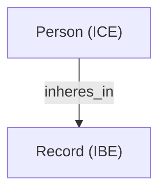
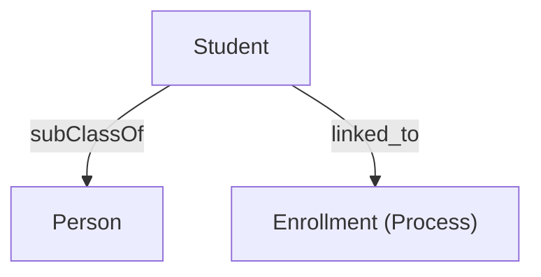
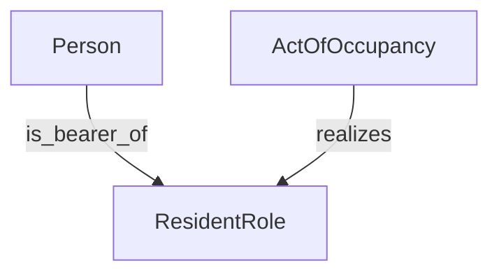

# **OntoGrade Functional Requirements Document (FRD) v2.0**

**Product:** OntoGrade – Deterministic Ontology Evaluation Service
**Author:** Aaron Damiano
**Date:** January 7, 2026
**Version:** 2.0

---

## 1. Product Overview

**OntoGrade** is a deterministic validation service that evaluates knowledge models against **Basic Formal Ontology (BFO)** and **Common Core Ontologies (CCO)**. It ingests RDF-based models (or lifted representations from diagrams like Mermaid.js) and outputs a weighted **Ontological Quality Score**, reflecting:

* **BFO compliance** (structural correctness)
* **Logical integrity** (reasoning consistency)
* **CCO best practices** (pattern adherence)

The service provides **developer-friendly error logs**, **JSON-LD reports**, and **recommendations for remediation**.

---

## 2. Functional Requirements

### FR-1: Model Ingestion & Lifting

The system shall ingest knowledge models and normalize them into an RDF graph.

* **FR-1.1:** Support `.ttl` (Turtle), `.rdf` (RDF/XML), and `.json-ld`.
* **FR-1.2: Mermaid.js Lifting** – Convert Mermaid diagrams into RDF triples according to these standards:

  **Mermaid Node Conventions:**

  * Independent Continuants (real entities) → `ClassName_<id>`
  * Dependent Continuants (Roles, Dispositions) → `Role_<id>`
  * Occurrents (Processes) → `Process_<id>`
  * Information Content Entities (ICE) → `ICE_<id>`
  * Information Bearing Entities (IBE) → `IBE_<id>`
  * Literals → `Literal_<datatype>`

  **Mermaid Edge Conventions:**

  * `is_bearer_of` → links Independent Continuant → Role
  * `realizes` → links Process → Role
  * `is_designated_by` → links entity → ICE
  * `is_concretized_by` → links ICE → IBE
  * `has_text_value` → links IBE → literal
  * `designates` → inverse of `is_designated_by` (for querying convenience)

  **Example Standardized Mermaid:**

  ```mermaid
  graph TD
  Person_0["Person<br>IRI: cco:Person"]
  Role_0["ResidentRole<br>IRI: cco:ResidentRole"]
  Person_0 -->|is_bearer_of| Role_0
  ```

---

### FR-2: Structural Alignment (BFO Rooting)

The system shall verify that **all user-defined classes** are rooted in BFO.

* **FR-2.1:** Execute SPARQL pathfinding from each class to `bfo:Entity`.
* **FR-2.2:** Detect **orphan classes** with no path to a BFO root.
* **FR-2.3:** Handle **multi-root and cyclic structures**:

  * Multiple valid BFO root paths are allowed.
  * Cycles trigger warnings but do not fail the model unless they prevent path resolution.

---

### FR-3: CCO Pattern Validation (SHACL)

The system shall enforce CCO patterns via SHACL:

* **FR-3.1:** **Information Staircase Pattern**: ICE → `is_concretized_by` → IBE → `has_text_value` → literal
* **FR-3.2:** **Role Pattern**: Realizable entities must be linked to an independent continuant via `is_bearer_of`.
* **FR-3.3:** **Designation Pattern**: Entities linked to names or identifiers must use `designated_by` and optionally `designates` as inverse.

*Developer Notes:* SHACL shapes will be provided as templates; partial violations are logged and scored proportionally.

---

### FR-4: Logical Integrity (Reasoning)

* **FR-4.1:** Invoke a DL Reasoner (e.g., HermiT) to detect **disjointness violations**.
* **FR-4.2:** Flag **type collisions**, e.g., entity inferred as both `BFO:Process` and `BFO:Object`.
* **FR-4.3:** Partial violations decrement the **Logic Integrity score proportionally**.

---

## 3. Acceptance Criteria & Weighted Scoring

| Dimension              | Weight | Must Pass                            | Partial Compliance                               |
| ---------------------- | ------ | ------------------------------------ | ------------------------------------------------ |
| **BFO Compliance**     | 30%    | All classes must resolve to BFO root | % of classes rooted → proportional score         |
| **Logic Integrity**    | 40%    | OWL reasoner reports consistency     | % of reasoning rules passed → proportional score |
| **CCO Best Practices** | 30%    | Zero SHACL violations                | % of SHACL rules passed → proportional score     |

---

## 4. Examples & Scenarios

**Example 1 – ICE Mislink (Failure)**



* **Score:** 2.0/5
* **Log:** `[SHACL Violation] 'inheres_in' used; should be 'is_concretized_by'`

**Example 2 – Taxonomic Confusion (Failure)**



* **Score:** 1.0/5
* **Log:** `[Reasoning Error] 'Student' inferred as Continuant and Occurrent.`

**Example 3 – Perfect Model (Success)**



* **Score:** 5.0/5
* **Log:** All BFO roots resolved. CCO patterns satisfied. Model consistent.

---

## 5. System Output

**JSON-LD Example:**

```json
{
  "ontograde_version": "2.0",
  "timestamp": "2026-01-07T16:00:00-05:00",
  "final_score": 4.8,
  "summary": {
    "bfo_rooting": "Pass",
    "logic_consistency": "Pass",
    "pattern_adherence": "Partial (Missing inverse designation link)"
  },
  "violations": [
    {
      "type": "SHACL",
      "description": "Missing designates link from PersonName to Person",
      "entity": "PersonName"
    }
  ],
  "recommendations": [
    "Add cco:designates link from PersonName to Person to complete inverse relation"
  ]
}
```

---

## 6. Developer Notes

* **Mermaid Lifting**: Use node and edge conventions consistently. All ICEs must have corresponding IBE.
* **SPARQL Pathfinding**: Implement recursive queries for BFO rooting; log orphans.
* **SHACL**: Maintain separate SHACL files for each pattern; support partial scoring.
* **Reasoner**: Use OWL 2 DL-compliant reasoners; provide clear logs for type collisions.

---

## 7. Recommended System Architecture (Textual)

```
[Model Input: TTL / RDF / JSON-LD / Mermaid]
         |
         v
[Parser & RDF Graph Normalizer]
         |
         v
[SPARQL Rooting Validator] ---> [Orphan Log]
         |
         v
[SHACL Pattern Validator] ---> [Violation Log]
         |
         v
[OWL/DL Reasoner] ---> [Reasoning Log]
         |
         v
[Weighted Scoring Engine] ---> [JSON-LD Output]

