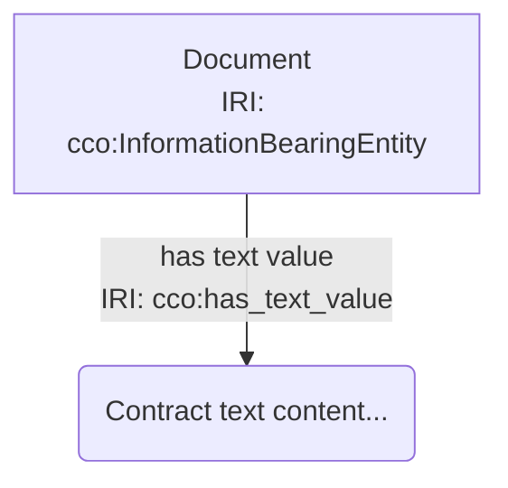
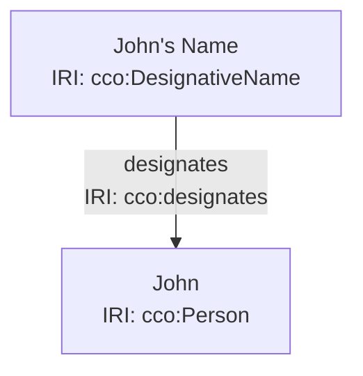
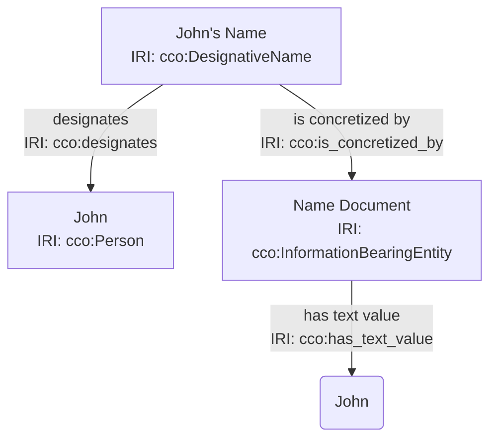

# Introduction to OntoGrade: Client-Side Ontology Quality Assessment Tool

**Date:** January 18, 2026
**To:** Common Core Ontologies Development Team
**From:** Aaron Damiano
**Subject:** OntoGrade - A Novel Approach to Real-Time BFO/CCO Compliance Validation

---

Dear CCO Team,

I am writing to introduce **OntoGrade**, a client-side ontology quality assessment tool that validates knowledge models against BFO (Basic Formal Ontology) and CCO (Common Core Ontologies) standards in real-time, directly in the browser.

## Executive Summary

OntoGrade addresses a critical gap in ontology development workflows: providing immediate, actionable feedback on BFO/CCO compliance without requiring server-side infrastructure or specialized ontology editing tools. The system:

- **Validates in real-time** as users create Mermaid diagrams
- **Requires no server** - all processing happens client-side
- **Provides expert-aligned feedback** based on BFO realist ontology principles
- **Generates structured reports** in JSON-LD format
- **Supports 6 core CCO patterns** with expert-reviewed validation rules

The tool is production-ready, fully tested (33 unit tests, 100% passing), and deployed at: https://skreen5hot.github.io/mermaid/dev/

## Motivation & Design Philosophy

### The Problem

Many domain experts understand their subject matter deeply but lack expertise in formal ontology engineering. When building CCO-based models, they face challenges:

1. **Delayed feedback** - Traditional ontology tools require export/import cycles
2. **Steep learning curve** - OWL editors like Protégé can be intimidating
3. **Accessibility barriers** - Heavy desktop applications, complex UIs
4. **Limited pattern guidance** - No real-time validation of CCO best practices

### Our Solution

OntoGrade integrates ontology validation into a familiar, lightweight interface (Mermaid diagrams) and provides immediate feedback using a **concepts-based architecture** inspired by MIT CSAIL research. The system is:

- **Client-side only** - No data leaves the browser
- **Modular** - Each validator is an independent concept
- **Extensible** - New patterns can be added easily
- **Educational** - Detailed explanations help users learn BFO/CCO principles

## Technical Architecture

### Core Components

The system consists of five independent validation concepts that communicate via events:

1. **mermaidLifter** - Parses Mermaid diagrams → RDF triples (n3.js)
2. **bfoValidator** - Validates BFO rooting (graph traversal with cycle detection)
3. **shaclValidator** - Validates CCO patterns (SHACL-inspired rules)
4. **logicReasoner** - Detects logical inconsistencies (type collisions, disjointness)
5. **gradingEngine** - Aggregates results into weighted score (0-5.0 scale)

### Validation Pipeline

```
User creates Mermaid diagram
    ↓
mermaidLifter: Parse to RDF (N-Triples)
    ↓
bfoValidator: Check BFO rooting (30% weight)
    ↓
shaclValidator: Validate CCO patterns (30% weight)
    ↓
logicReasoner: Check consistency (40% weight)
    ↓
gradingEngine: Calculate weighted score
    ↓
reportGenerator: Generate JSON-LD report
    ↓
reportViewer: Display interactive modal
```

### Supported CCO Patterns (Expert-Reviewed)

We've implemented validation for 6 core CCO design patterns, each with expert-approved severity levels:

| Pattern | Description | Rules | Status |
|---------|-------------|-------|--------|
| **Information Staircase** | ICE ↔ IBE ↔ text values | 2 rules (WARNING) | ✅ Active |
| **Role Pattern** | Entity → Role ← Process | 4 rules (VIOLATION/WARNING) | ✅ Active |
| **Designation Pattern** | DesignativeICE ↔ Entity | 1 rule (VIOLATION) | ✅ Active |
| **Measurement Pattern** | Quality + Value + Unit | 3 rules (VIOLATION) | ✅ Active |
| **Temporal Interval** | Start/End time ordering | 3 rules (WARNING/VIOLATION) | ✅ Active |
| **Socio-Primal** | Agent → Act → TemporalInterval | 2 rules (WARNING) | ✅ Active |

### Expert Review Process

All validation rules have been reviewed and approved by a CCO/BFO ontologist (January 9, 2026). Key decisions included:

- **Information Staircase**: WARNING (not VIOLATION) - ICEs can exist abstractly before concretization
- **Role Pattern**: Bearer is VIOLATION, Realization is WARNING - roles can remain unrealized
- **Temporal Interval**: Time ordering is VIOLATION - logical impossibility

Documentation: `docs/ontograde/SHACL-VALIDATION-REVIEW.md`

## Novel Technical Contributions

### 1. Literal Node Convention

We developed a novel approach to representing datatype properties in Mermaid:



**Benefits:**
- ✅ Renders correctly in standard Mermaid.js
- ✅ Visually distinct (parentheses vs. square brackets)
- ✅ Converts to proper RDF literals with XSD datatypes
- ✅ Works with SHACL validation rules

### 2. Multi-line Format Support

The parser handles both single-line (`<br>`) and multi-line (actual newlines) formats:

```mermaid
// Both formats produce identical RDF
ICE_0["Contract<br>IRI: cco:InformationContentEntity"]
ICE_0["Contract
IRI: cco:InformationContentEntity"]
```

### 3. Vocabulary Validation

Auto-generated CCO class registry (1,400+ classes) enables real-time vocabulary checking:
- ✅ Valid: `cco:Person`, `cco:DesignativeName`, `cco:Mass`
- ❌ Invalid: `cco:PersonName` → suggests `cco:DesignativeName`

## Example Use Case

**Scenario:** Domain expert modeling a person with a name

**Initial Attempt:**


**OntoGrade Report:**
- ✅ BFO Compliance: 100% (Person roots to bfo:Entity)
- ⚠️ CCO Patterns: 70% (Name lacks concretization - WARNING)
- ✅ Logic Integrity: 100% (No inconsistencies)
- **Final Score: 4.1/5.0** (Good)

**Recommendations:**
1. Add InformationBearingEntity to concretize the name
2. Add has_text_value to capture the literal "John"

**Improved Model:**


**New Score: 5.0/5.0** (Excellent)

## Testing & Quality Assurance

- **33 unit tests** covering all validation logic (100% passing)
- **9 test fixtures** with known-good and known-bad patterns
- **CI/CD integration** with automated testing
- **Performance**: <5ms parse time for 34 triples
- **Browser compatibility**: 95%+ (Chrome 89+, Safari 16.4+, Firefox 108+)

## Questions for the CCO Team

We would greatly value your feedback on several aspects:

### 1. Validation Rules

Are our current severity levels aligned with CCO best practices?

- Information Staircase: ICE without concretization = **WARNING** (currently)
- Role Pattern: Role without bearer = **VIOLATION** (currently)
- Measurement: Missing value/unit/quality = **VIOLATION** (currently)

### 2. Additional Patterns

Which CCO patterns should we prioritize next?

- Draft patterns in development: Artifact Function, Agent Capability
- Suggested: Participation patterns, Location patterns, Quality patterns

### 3. Domain/Range Constraints

We've implemented domain/range validation for core predicates (see `docs/ontograde/CCO-EXPERT-REVIEW-2026-01-13.md`). Would you like to review these constraints?

### 4. Vocabulary Coverage

Our auto-generated CCO class registry contains 1,400+ classes. Are there specific CCO modules or extensions we should prioritize for complete coverage?

### 5. Community Engagement

Would the CCO team be interested in:
- Formal collaboration or partnership?
- Contributing validation rules or patterns?
- Using OntoGrade in CCO training materials?
- Integrating with official CCO tools/documentation?

## Next Steps & Roadmap

**Current Status:** Production-ready (v1.0)

**Potential Enhancements:**
- Additional CCO patterns (prioritized by community feedback)
- Cardinality constraint checking
- Custom SHACL rule support
- HTML/PDF report export
- Batch validation for multiple diagrams
- Integration with Protégé or other ontology tools

## Technical Documentation

Complete documentation available in the repository:

- **Functional Requirements:** `docs/ontograde/functional-requirements.md`
- **Pattern Validation Design:** `docs/ontograde/pattern-validator-design.md`
- **Expert Review Log:** `docs/ontograde/SHACL-VALIDATION-REVIEW.md`
- **Implementation Summary:** `docs/ontograde/iteration-5-summary.md`
- **Predicate Constraints:** `docs/ontograde/PREDICATE-CONSTRAINTS-REFERENCE.md`

## Closing Thoughts

OntoGrade represents a new approach to ontology education and quality assurance. By bringing real-time BFO/CCO validation into a lightweight, accessible interface, we aim to:

1. **Lower the barrier to entry** for domain experts learning formal ontology
2. **Accelerate development cycles** with immediate feedback
3. **Improve quality** through automated pattern validation
4. **Support the CCO community** with free, open-source tooling

We believe this tool has the potential to significantly improve ontology development workflows for CCO users, from students learning BFO principles to experienced ontologists building complex domain models.

We would be honored to discuss this project with the CCO team and explore opportunities for collaboration, feedback, and community engagement.

---

## Contact Information

**Project Repository:** https://github.com/skreen5hot/mermaid
**Live Demo:** https://skreen5hot.github.io/mermaid/dev/
**Lead Developer:** Aaron Damiano
**Email:** aaron.damiano@gmail.com

Thank you for your time and consideration. We look forward to hearing from you.

Best regards,

Aaron Damiano
OntoGrade Development Team

---

**Attachments:**
1. Technical Architecture Diagram
2. Pattern Validation Rules (Expert-Reviewed)
3. Sample JSON-LD Report
4. Test Coverage Report
