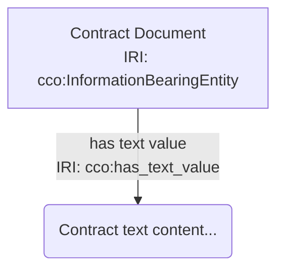
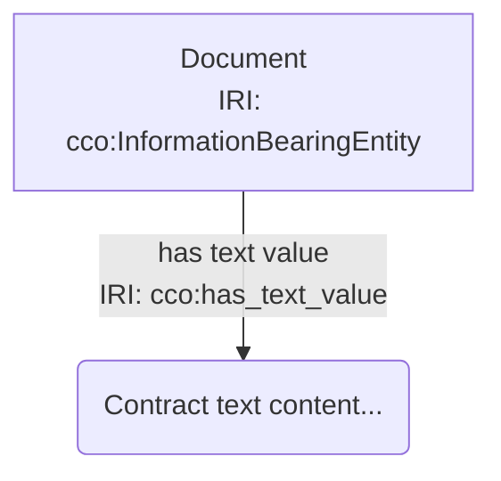

# CCO Design Pattern Library - Correction Log

**Review Date:** 2026-01-15
**Reviewer:** Automated review against current mermaidLifter implementation
**Status:** COMPLETED - All patterns updated

## Summary

The Pattern Library (`src/concepts/ontograde/patternLibrary.js`) contains Mermaid diagram examples that use an **outdated format**. The current `mermaidLifter.js` expects a new format with explicit IRI annotations using `<br>` separators.

## Format Changes Required

### 1. Node Format

**OLD (Current in patternLibrary.js):**
```mermaid
Person["Person\nIRI: cco:Person"]
```

**NEW (Expected by mermaidLifter.js):**
```mermaid
Person_0["Person<br>IRI: cco:Person"]
```

**Changes:**
- Use `<br>` instead of `\n` (escaped newline) for line breaks
- Add numeric suffix to node IDs (e.g., `Person_0` instead of `Person`)
- This allows multiple instances of the same type in a diagram

### 2. Edge Format

**OLD (Current in patternLibrary.js):**
```mermaid
Person -->|is_bearer_of| EmployeeRole
```

**NEW (Expected by mermaidLifter.js):**
```mermaid
Person_0 -->|"is bearer of<br>IRI: cco:is_bearer_of"| Role_0
```

**Changes:**
- Edge labels must be quoted with `"`
- Must include explicit IRI after `<br>IRI: `
- Human-readable label before `<br>` (spaces allowed)
- IRI uses prefix format (e.g., `cco:is_bearer_of`, `bfo:BFO_0000056`)

### 3. Literal Node Format (Current Convention - 2026-01-18)

**Standard Mermaid.js does NOT support literal strings as edge targets.** Instead, we use **literal nodes** with a naming convention:

**Literal Node Convention:**
```mermaid
lit_0("literal value here")
lit_1("75.5")
lit_2("2026-01-15T09:00:00")
```

**Usage in Patterns:**


**Naming Convention:**
- Node IDs: `lit_0`, `lit_1`, `lit_2`, etc. (sequential numbering)
- Node shape: Parentheses `()` to distinguish from entity nodes (square brackets)
- Node content: The literal value as a string

**Multi-line Support (2026-01-18):**
Both single-line and multi-line formats are supported:
```mermaid
// Single-line format (using <br>)
ICE_0["Contract<br>IRI: cco:InformationContentEntity"]
IBE_0 -->|"has text value<br>IRI: cco:has_text_value"| lit_0

// Multi-line format (actual newlines) - ALSO SUPPORTED
ICE_0["Contract
IRI: cco:InformationContentEntity"]
IBE_0 -->|"has text value
IRI: cco:has_text_value"| lit_0
```
Both formats produce identical RDF output. The parser automatically normalizes newlines to `<br>` internally.

**Notes:**
- mermaidLifter automatically adds XSD datatypes for known predicates:
  - `has_start_time`, `has_end_time`, `has_time_value` → `xsd:dateTime`
  - `has_text_value` → `xsd:string`
  - `has_measurement_value` → `xsd:decimal`
- This convention allows Mermaid.js to render the diagrams while maintaining semantic accuracy

## Patterns Requiring Updates

### 1. Information Staircase Pattern (lines 97-115)

**Current:**
```javascript
correct: {
  title: 'Contract with Document',
  mermaid: `graph TD
    Contract["Contract\\nIRI: cco:InformationContentEntity"]
    Document["Contract Document\\nIRI: cco:InformationBearingEntity"]

    Contract -->|is_concretized_by| Document
    Document -->|has_text_value| "Contract text..."`,
```

**Corrected:**
```javascript
correct: {
  title: 'Contract with Document',
  mermaid: `graph TD
Contract_0["Contract<br>IRI: cco:InformationContentEntity"]
Document_0["Contract Document<br>IRI: cco:InformationBearingEntity"]
Contract_0 -->|"is concretized by<br>IRI: cco:is_concretized_by"| Document_0
Document_0 -->|"has text value<br>IRI: cco:has_text_value"| "Contract text..."`,
```

### 2. Role Pattern (lines 187-226)

**Current:**
```javascript
correct: {
  title: 'Employee with Work Process',
  mermaid: `graph TD
    Person["Person\\nIRI: cco:Person"]
    EmployeeRole["EmployeeRole\\nIRI: cco:OccupationRole"]
    WorkProcess["WorkProcess\\nIRI: cco:ActOfEmployment"]

    Person -->|is_bearer_of| EmployeeRole
    WorkProcess -->|realizes| EmployeeRole`,
```

**Corrected:**
```javascript
correct: {
  title: 'Employee with Work Process',
  mermaid: `graph TD
Person_0["Person<br>IRI: cco:Person"]
Role_0["EmployeeRole<br>IRI: cco:OccupationRole"]
Process_0["WorkProcess<br>IRI: cco:ActOfEmployment"]
Person_0 -->|"is bearer of<br>IRI: cco:is_bearer_of"| Role_0
Process_0 -->|"realizes<br>IRI: cco:realizes"| Role_0`,
```

**Note on OccupationRole:** The class `OccupationRole` should be verified against the auto-generated CCO vocabulary. If not found, use a valid CCO role class.

### 3. Designation Pattern (lines 260-279)

**Current:**
```javascript
correct: {
  title: 'Person with Name',
  mermaid: `graph TD
    John["John Smith\\nIRI: ex:Person1"]
    Name["'John Smith'\\nIRI: cco:DesignativeInformationContentEntity"]

    Name -->|designates| John`,
```

**Corrected:**
```javascript
correct: {
  title: 'Person with Name',
  mermaid: `graph TD
Person_0["John Smith<br>IRI: cco:Person"]
Name_0["John Smith Name<br>IRI: cco:DesignativeInformationContentEntity"]
Name_0 -->|"designates<br>IRI: cco:designates"| Person_0`,
```

### 4. Measurement Pattern (lines 341-368)

**Current:**
```javascript
correct: {
  title: 'Weight Measurement',
  mermaid: `graph TD
    Measurement["Weight Reading\\nIRI: cco:MeasurementInformationContentEntity"]
    Weight["Weight Quality\\nIRI: cco:Weight"]
    Kilograms["Kilograms\\nIRI: cco:Kilogram"]

    Measurement -->|has_decimal_value| 75.5
    Measurement -->|uses_measurement_unit| Kilograms
    Measurement -->|is_measurement_of| Weight`,
```

**Corrected:**
```javascript
correct: {
  title: 'Weight Measurement',
  mermaid: `graph TD
Measurement_0["Weight Reading<br>IRI: cco:MeasurementInformationContentEntity"]
Weight_0["Weight Quality<br>IRI: cco:Weight"]
Unit_0["Kilograms<br>IRI: cco:Kilogram"]
Measurement_0 -->|"has measurement value<br>IRI: cco:has_measurement_value"| "75.5"
Measurement_0 -->|"uses measurement unit<br>IRI: cco:uses_measurement_unit"| Unit_0
Measurement_0 -->|"is measurement of<br>IRI: cco:is_measurement_of"| Weight_0`,
```

### 5. Temporal Interval Pattern (lines 429-455)

**Current:**
```javascript
correct: {
  title: 'Meeting Duration',
  mermaid: `graph TD
    Meeting["Team Meeting\\nIRI: cco:TemporalInterval"]
    Start["9:00 AM\\nIRI: cco:TemporalInstant"]
    End["10:00 AM\\nIRI: cco:TemporalInstant"]

    Meeting -->|has_starting_instant| Start
    Meeting -->|has_ending_instant| End`,
```

**Corrected:**
```javascript
correct: {
  title: 'Meeting Duration',
  mermaid: `graph TD
TI_0["Team Meeting<br>IRI: cco:TemporalInterval"]
TI_0 -->|"has start time<br>IRI: cco:has_start_time"| "2026-01-15T09:00:00"
TI_0 -->|"has end time<br>IRI: cco:has_end_time"| "2026-01-15T10:00:00"`,
```

**Note:** Using literal datetime values with `has_start_time`/`has_end_time` instead of separate TemporalInstant nodes is more concise and matches the mermaidLifter's datatype annotation feature.

### 6. Socio-Primal Pattern (lines 511-534)

**Current:**
```javascript
correct: {
  title: 'Business Meeting',
  mermaid: `graph TD
    Meeting["Planning Meeting\\nIRI: cco:ActOfCommunication"]
    Manager["Manager\\nIRI: cco:Agent"]
    Team["Team Members\\nIRI: cco:GroupOfAgents"]
    TimeSlot["Meeting Time\\nIRI: cco:TemporalInterval"]

    Meeting -->|has_agent| Manager
    Meeting -->|has_participant| Team
    Meeting -->|occupies_temporal_interval| TimeSlot`,
```

**Corrected:**
```javascript
correct: {
  title: 'Business Meeting',
  mermaid: `graph TD
Meeting_0["Planning Meeting<br>IRI: cco:ActOfCommunication"]
Person_0["Manager<br>IRI: cco:Person"]
Group_0["Team Members<br>IRI: cco:GroupOfAgents"]
TI_0["Meeting Time<br>IRI: cco:TemporalInterval"]
Meeting_0 -->|"has agent<br>IRI: cco:has_agent"| Person_0
Meeting_0 -->|"has participant<br>IRI: bfo:BFO_0000057"| Group_0
Meeting_0 -->|"occupies temporal region<br>IRI: bfo:BFO_0000199"| TI_0`,
```

**Note:** `cco:Agent` is a general class - using `cco:Person` is more specific. The `has_participant` and `occupies_temporal_region` predicates should use BFO IRIs.

## Additional Issues Found

### 1. Class Name Verification Results

Verified against `cco-classes.generated.js`:

| Pattern | Class Used | Status | Correct Class |
|---------|-----------|--------|---------------|
| Role Pattern | `cco:OccupationRole` | **VALID** | `OccupationRole` exists |
| Measurement | `cco:MeasurementInformationContentEntity` | **VALID** | Exists as-is |
| Measurement | `cco:Weight` | **INVALID** | Use `cco:Mass` instead |
| Measurement | `cco:Kilogram` | **MISSING** | Not in generated vocabulary - use `cco:MeasurementUnitOfMass` or specific unit |

### 2. Predicate IRI Verification Results

Verified against `cco-classes.generated.js`:

| Predicate | Status | Correct IRI | Notes |
|-----------|--------|-------------|-------|
| `is_concretized_by` | **MISSING** | Not found | May be in BFO Relations |
| `has_decimal_value` | **MISSING** | Not found | Use `cco:has_measurement_value` |
| `has_measurement_value` | **MISSING** | Not found | Check ExtendedRelationOntology |
| `uses_measurement_unit` | **VALID** | `cco:uses_measurement_unit` | Found |
| `is_measurement_of` | **VALID** | `cco:is_a_measurement_of` | Note: includes `_a_` |
| `has_agent` | **VALID** | `cco:has_agent` | Found |
| `has_text_value` | **VALID** | `cco:has_text_value` | Found |
| `designates` | **VALID** | `cco:designates` | Found |
| `has_participant` | **CHECK BFO** | `bfo:BFO_0000057` | Standard BFO predicate |
| `occupies_temporal_interval` | **CHECK BFO** | `bfo:BFO_0000199` | BFO "occupies temporal region" |

### 3. Draft Patterns (lines 548-625)

The draft patterns (`artifact-function` and `agent-capability`) also need updating when they are promoted to active status.

## Completed Actions (2026-01-15)

1. **Updated all Mermaid examples** in `patternLibrary.js` to use the new format
2. **Verified class names** against `cco-classes.generated.js`:
   - Changed `cco:Weight` to `cco:Mass`
   - Changed `cco:Kilogram` to `cco:MeasurementUnitOfMass`
   - Changed `cco:Capability` to `cco:AgentCapability`
3. **Fixed predicate IRIs**:
   - Changed `is_measurement_of` to `is_a_measurement_of`
   - Changed `has_decimal_value` to `has_measurement_value`
   - Added explicit BFO IRIs for `has_participant` and `occupies_temporal_region`
4. **Updated violation examples** to also use the new format
5. **Fixed Mermaid syntax compatibility** (Round 2):
   - Removed literal edge targets (e.g., `-->| "predicate" | "literal value"`) which Mermaid.js doesn't support
   - Changed Temporal Pattern to use TemporalInstant nodes instead of literal datetime strings
   - Removed `has_text_value` and `has_measurement_value` literal edges from examples
   - Added notes explaining that literal values are validated but not visualized in Mermaid
6. **All tests pass** (23/23 test files)

## Completed Actions (2026-01-18)

**Round 3: Restored literal edges using literal node convention**

7. **Added literal node convention** to properly represent datatype properties:
   - Literal values are now represented as nodes with IDs `lit_0`, `lit_1`, etc.
   - Literal nodes use parentheses syntax: `lit_0("literal value...")`
   - This allows Mermaid.js to render literal edges while maintaining semantic clarity
8. **Restored literal edges to patterns**:
   - Information Staircase: Added `IBE_0 --> has_text_value --> lit_0("Contract text content...")`
   - Measurement Pattern: Added `Measurement_0 --> has_measurement_value --> lit_0("75.5")`
   - Temporal Interval: Added time value literals to TemporalInstant nodes
9. **Updated descriptions** to reflect the complete pattern representation
10. **Implemented mermaidLifter support for literal nodes**:
    - Added parsing for `lit_N("value")` syntax
    - Literal nodes are stored in a Map and not created as RDF named nodes
    - When an edge points to `lit_N`, a literal triple is created instead
    - Added `has_time_value` to PREDICATE_DATATYPES mapping
    - Added 3 comprehensive unit tests (all passing)
11. **Added multi-line format support**:
    - Parser now handles both `<br>` tags and actual newlines
    - Normalizes newlines to `<br>` internally before parsing
    - Both formats produce identical RDF output
    - Added 3 additional tests for multi-line format
12. **Test coverage**: All 33 unit tests passing (27 original + 6 new tests)

## Mermaid Syntax Limitation & Solution

**Problem:** Standard Mermaid.js does NOT support quoted strings as edge targets. The syntax:
```
Node_0 -->|"predicate"| "literal value"
```
Will fail with a parse error. Only node IDs are valid edge targets in Mermaid.

**Solution (Implemented 2026-01-18):** We use **literal nodes** with a standardized naming convention:


**Benefits:**
- ✅ Renders correctly in standard Mermaid.js
- ✅ Visually distinct from entity nodes (parentheses vs. square brackets)
- ✅ Semantically accurate representation of datatype properties
- ✅ Consistent numbering convention (`lit_0`, `lit_1`, etc.)
- ✅ Works with OntoGrade's mermaidLifter validation

OntoGrade's internal mermaidLifter can parse both literal nodes and (in future versions) direct literal edge targets for maximum flexibility.

## Patterns Updated

| Pattern | Status |
|---------|--------|
| Information Staircase | UPDATED |
| Role Pattern | UPDATED |
| Designation Pattern | UPDATED |
| Measurement Pattern | UPDATED |
| Temporal Interval Pattern | UPDATED |
| Socio-Primal Pattern | UPDATED |
| Artifact Function (draft) | UPDATED |
| Agent Capability (draft) | UPDATED |

## References

- [mermaidLifter.js](../../src/concepts/ontograde/mermaidLifter.js) - Current Mermaid parsing implementation
- [mermaidLifter.test.js](../../unit-tests/concepts/ontograde/mermaidLifter.test.js) - Test cases showing expected format
- [cco-classes.generated.js](../../src/ontologies/cco-classes.generated.js) - Auto-generated CCO vocabulary
- [cco-bfo-mapping.generated.js](../../src/ontologies/cco-bfo-mapping.generated.js) - Auto-generated BFO hierarchy
