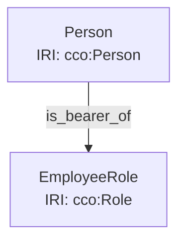

# OntoGrade Pattern Validator - Detailed Design

**Project:** OntoGrade Pattern Validator Hardening
**Phase:** Design
**Date:** 2026-01-09
**Status:** In Progress
**References:** [Pattern Validation Requirements](pattern-validation-requirements.md)

## Table of Contents
1. [Architecture Overview](#architecture-overview)
2. [Pattern Registry System](#pattern-registry-system)
3. [Validation Modes (Strict vs Permissive)](#validation-modes)
4. [Pattern Library Browser UI](#pattern-library-browser-ui)
5. [Pattern Implementation Guide](#pattern-implementation-guide)
6. [Testing Strategy](#testing-strategy)

---

## Architecture Overview

### Current Architecture
```
shaclValidator.js (monolithic)
├── checkPatterns()
│   ├── checkInformationStaircase()
│   ├── checkRolePattern()
│   └── checkDesignationPattern()
└── helpers
    ├── findEntitiesOfType()
    └── getShortIri()
```

### New Architecture
```
shaclValidator.js (orchestrator)
├── PatternRegistry
│   ├── registerPattern()
│   ├── getPattern()
│   ├── getAllPatterns()
│   └── getEnabledPatterns()
└── validatePatterns()
    └── for each enabled pattern:
        └── pattern.validate(rdfGraph)

patterns/
├── BasePattern.js (abstract base class)
├── core/
│   ├── RolePattern.js
│   ├── InformationStaircasePattern.js
│   └── DesignationPattern.js
├── temporal/
│   ├── TemporalIntervalPattern.js
│   └── EventOccurrencePattern.js
├── geospatial/
│   ├── GeospatialLocationPattern.js
│   └── FacilityLocationPattern.js
├── measurement/
│   ├── MeasurementPattern.js
│   └── RatioMeasurementPattern.js
├── artifact/
│   ├── ArtifactFunctionPattern.js
│   └── ArtifactComponentPattern.js
├── agent/
│   ├── AgentCapabilityPattern.js
│   └── OrganizationMembershipPattern.js
├── act/
│   ├── ActObjectivePattern.js
│   └── ActParticipantPattern.js
└── event/
    └── EventCausationPattern.js

patternLibrary.js (UI component)
└── Pattern Library Browser
```

### Benefits of New Architecture
- ✅ **Modular**: Each pattern is independent, testable module
- ✅ **Extensible**: Easy to add new patterns without touching existing code
- ✅ **Maintainable**: Clear separation of concerns
- ✅ **Configurable**: Patterns can be enabled/disabled individually
- ✅ **Testable**: Each pattern has isolated unit tests

---

## Pattern Registry System

### Pattern Metadata Schema

```javascript
{
  id: 'role-pattern',
  name: 'Role Pattern',
  category: 'core',
  version: '1.0.0',
  enabled: true,
  severity: 'error', // 'error', 'warning', 'info'
  description: 'Validates that roles have both bearers and realizations',

  requiredRelationships: [
    'Entity → is_bearer_of → Role',
    'Process → realizes → Role'
  ],

  ccoReference: 'https://github.com/CommonCoreOntology/...',

  examples: {
    correct: 'examples/diagrams/patterns/role-pattern-correct.mmd',
    incorrect: 'examples/diagrams/patterns/role-pattern-violations.mmd'
  },

  validationRules: [
    {
      rule: 'Every Role must have at least one bearer',
      severity: 'error',
      rationale: 'Roles are dispositional properties that must be borne by entities'
    },
    {
      rule: 'Every Role must be realized by at least one Process',
      severity: 'error',
      rationale: 'Roles must be actualized through processes'
    },
    {
      rule: 'Bearers must be subclasses of IndependentContinuant',
      severity: 'error',
      rationale: 'Only independent continuants can bear roles'
    }
  ],

  detectsWhen: [
    'RDF graph contains entities typed as cco:Role'
  ],

  tags: ['core', 'roles', 'dispositions']
}
```

### BasePattern Class

```javascript
/**
 * Abstract base class for all pattern validators
 */
export class BasePattern {
  constructor(metadata) {
    this.id = metadata.id;
    this.name = metadata.name;
    this.category = metadata.category;
    this.version = metadata.version;
    this.enabled = metadata.enabled ?? true;
    this.severity = metadata.severity ?? 'error';
    this.description = metadata.description;
    this.metadata = metadata;
  }

  /**
   * Detect if this pattern is present in the RDF graph
   * @param {Store} rdfGraph - N3 Store
   * @returns {boolean} True if pattern entities found
   */
  detect(rdfGraph) {
    throw new Error('detect() must be implemented by subclass');
  }

  /**
   * Validate the pattern in the RDF graph
   * @param {Store} rdfGraph - N3 Store
   * @returns {Array<Violation>} Array of violations (empty if valid)
   */
  validate(rdfGraph) {
    throw new Error('validate() must be implemented by subclass');
  }

  /**
   * Get pattern metadata for UI display
   * @returns {Object} Pattern metadata
   */
  getMetadata() {
    return this.metadata;
  }

  /**
   * Helper: Find entities of a specific type
   */
  findEntitiesOfType(rdfGraph, typeIri) {
    const RDF_TYPE = 'http://www.w3.org/1999/02/22-rdf-syntax-ns#type';
    const entities = new Set();

    const quads = rdfGraph.getQuads(null, RDF_TYPE, typeIri, null);
    for (const quad of quads) {
      entities.add(quad.subject.value);
    }

    return Array.from(entities);
  }

  /**
   * Helper: Create violation object
   */
  createViolation(subject, message, severity = this.severity) {
    return {
      pattern: this.name,
      patternId: this.id,
      severity,
      subject,
      message,
      fix: this.generateFix(subject, message),
      explanation: this.explainViolation(message)
    };
  }

  /**
   * Generate fix suggestion for violation
   * @param {string} subject - Entity IRI
   * @param {string} message - Violation message
   * @returns {string} Fix suggestion
   */
  generateFix(subject, message) {
    // Subclasses can override for pattern-specific fixes
    return 'Review pattern requirements and add missing relationships';
  }

  /**
   * Explain why this violation matters
   * @param {string} message - Violation message
   * @returns {Object} Explanation with what, why, impact, fix
   */
  explainViolation(message) {
    return {
      what: message,
      why: 'This violates CCO design pattern requirements',
      impact: 'Ontology may not properly represent domain semantics',
      howToFix: this.generateFix()
    };
  }
}
```

### PatternRegistry

```javascript
/**
 * Central registry for all pattern validators
 */
export class PatternRegistry {
  constructor() {
    this.patterns = new Map();
  }

  /**
   * Register a pattern validator
   * @param {BasePattern} pattern - Pattern instance
   */
  register(pattern) {
    if (!(pattern instanceof BasePattern)) {
      throw new Error('Pattern must extend BasePattern');
    }

    this.patterns.set(pattern.id, pattern);
    console.log(`[PatternRegistry] Registered: ${pattern.name} (${pattern.id})`);
  }

  /**
   * Get a specific pattern by ID
   */
  getPattern(patternId) {
    return this.patterns.get(patternId);
  }

  /**
   * Get all registered patterns
   */
  getAllPatterns() {
    return Array.from(this.patterns.values());
  }

  /**
   * Get only enabled patterns
   */
  getEnabledPatterns() {
    return this.getAllPatterns().filter(p => p.enabled);
  }

  /**
   * Get patterns by category
   */
  getPatternsByCategory(category) {
    return this.getAllPatterns().filter(p => p.category === category);
  }

  /**
   * Detect which patterns are present in diagram
   */
  detectPatterns(rdfGraph) {
    const detected = [];

    for (const pattern of this.getAllPatterns()) {
      if (pattern.detect(rdfGraph)) {
        detected.push(pattern);
      }
    }

    return detected;
  }

  /**
   * Enable/disable a pattern
   */
  setPatternEnabled(patternId, enabled) {
    const pattern = this.getPattern(patternId);
    if (pattern) {
      pattern.enabled = enabled;
      console.log(`[PatternRegistry] ${pattern.name}: ${enabled ? 'enabled' : 'disabled'}`);
    }
  }
}

// Global registry instance
export const patternRegistry = new PatternRegistry();
```

---

## Validation Modes

### Strict vs Permissive Examples

Let's use the **Role Pattern** as an example to illustrate the difference:

#### Example Diagram: Role Missing Realization



**Issue:** Role has a bearer but no process that realizes it.

#### Strict Mode (Default)

```javascript
{
  mode: 'strict',
  behavior: 'All pattern violations are ERRORS that fail validation',

  result: {
    pass: false, // ❌ FAIL
    finalScore: 3.2, // Lower score due to error
    violations: [
      {
        pattern: 'Role Pattern',
        severity: 'error', // ← ERROR
        subject: 'ex:EmployeeRole',
        message: 'Role ex:EmployeeRole not realized by any process (missing realizes)',
        impact: 'HIGH',
        scoreImpact: -0.8
      }
    ]
  },

  userMessage: '❌ Validation FAILED: 1 pattern error found',
  color: 'red'
}
```

**When to use:**
- Generating ontologies for production use
- Ensuring CCO compliance before publication
- Educational contexts where correctness is critical
- Quality gates in CI/CD pipelines

#### Permissive Mode

```javascript
{
  mode: 'permissive',
  behavior: 'Pattern violations are WARNINGS that don\'t fail validation',

  result: {
    pass: true, // ✅ PASS (with warnings)
    finalScore: 4.5, // Higher score, warning has less impact
    violations: [
      {
        pattern: 'Role Pattern',
        severity: 'warning', // ← WARNING
        subject: 'ex:EmployeeRole',
        message: 'Role ex:EmployeeRole not realized by any process (missing realizes)',
        impact: 'MEDIUM',
        scoreImpact: -0.2
      }
    ]
  },

  userMessage: '⚠️ Validation PASSED with 1 warning',
  color: 'orange'
}
```

**When to use:**
- Early-stage ontology development
- Exploratory/draft diagrams
- Learning and experimentation
- When full pattern coverage isn't needed

#### Comparison Table

| Aspect | Strict Mode | Permissive Mode |
|--------|-------------|-----------------|
| **Pattern violations** | Errors | Warnings |
| **Validation passes?** | No (fails on violations) | Yes (with warnings) |
| **Score impact** | High (-0.5 to -1.0 per violation) | Low (-0.1 to -0.3 per violation) |
| **Use case** | Production, compliance | Development, learning |
| **User feedback** | ❌ "Fix these issues" | ⚠️ "Consider addressing" |
| **CI/CD behavior** | Blocks deployment | Allows deployment with warnings |

#### Custom Mode (Future Enhancement)

```javascript
{
  mode: 'custom',
  behavior: 'User configures severity per pattern',

  configuration: {
    'role-pattern': 'error',           // Critical
    'information-staircase': 'error',  // Critical
    'designation-pattern': 'warning',  // Nice-to-have
    'temporal-interval': 'info',       // Optional
    'event-causation': 'disabled'      // Not relevant
  },

  result: {
    pass: false, // Fails if any 'error' patterns violated
    violations: [
      { pattern: 'Role Pattern', severity: 'error' },      // Blocks
      { pattern: 'Designation Pattern', severity: 'warning' }, // Doesn't block
      { pattern: 'Temporal Interval', severity: 'info' }   // Just FYI
    ]
  }
}
```

### Recommendation

**Start with Strict Mode as default** because:
1. Encourages best practices from the start
2. Users learn correct patterns
3. Can always relax to permissive for drafts
4. Aligns with OntoGrade's goal of quality assurance

**Provide easy toggle:**
```html
<div class="validation-mode-selector">
  <label>
    <input type="radio" name="mode" value="strict" checked>
    🔒 Strict (Enforce all patterns)
  </label>
  <label>
    <input type="radio" name="mode" value="permissive">
    🔓 Permissive (Warnings only)
  </label>
</div>
```

---

## Pattern Library Browser UI

### New Page: Pattern Library

Add a new navigation item in the IDE:

```
┌─────────────────────────────────────┐
│  Mermaid Ontology IDE               │
├─────────────────────────────────────┤
│  📁 Projects                         │
│  📊 Diagrams                         │
│  🎓 OntoGrade                        │  ← Existing
│  📚 Pattern Library    ← NEW         │
│  ⚙️  Settings                        │
└─────────────────────────────────────┘
```

### Pattern Library Browser Layout

```html
<!DOCTYPE html>
<div id="pattern-library-page" class="page">
  <!-- Header -->
  <div class="pattern-library-header">
    <h1>📚 CCO Design Pattern Library</h1>
    <p class="subtitle">
      Browse and learn about Common Core Ontology design patterns validated by OntoGrade
    </p>

    <!-- Search & Filter -->
    <div class="pattern-controls">
      <input type="search"
             id="pattern-search"
             placeholder="Search patterns..."
             class="pattern-search">

      <select id="category-filter" class="category-filter">
        <option value="all">All Categories</option>
        <option value="core">Core Patterns (3)</option>
        <option value="temporal">Temporal (2)</option>
        <option value="geospatial">Geospatial (2)</option>
        <option value="measurement">Measurement (2)</option>
        <option value="artifact">Artifact (2)</option>
        <option value="agent">Agent (2)</option>
        <option value="act">Act (2)</option>
        <option value="event">Event (1)</option>
      </select>

      <div class="view-toggle">
        <button id="grid-view" class="active">Grid</button>
        <button id="list-view">List</button>
      </div>
    </div>
  </div>

  <!-- Pattern Grid -->
  <div class="pattern-grid">

    <!-- Pattern Card Example -->
    <div class="pattern-card" data-pattern-id="role-pattern">
      <div class="pattern-card-header">
        <h3>Role Pattern</h3>
        <span class="pattern-badge core">Core</span>
      </div>

      <div class="pattern-card-body">
        <p class="pattern-description">
          Roles are dispositional properties that entities bear and processes realize
        </p>

        <div class="pattern-structure">
          <code>Entity → is_bearer_of → Role</code><br>
          <code>Process → realizes → Role</code>
        </div>

        <div class="pattern-stats">
          <span class="stat">
            <span class="icon">✅</span> Validated
          </span>
          <span class="stat">
            <span class="icon">📝</span> 3 Rules
          </span>
          <span class="stat">
            <span class="icon">🧪</span> 8 Tests
          </span>
        </div>
      </div>

      <div class="pattern-card-footer">
        <button class="btn-secondary" onclick="viewPatternDetails('role-pattern')">
          View Details
        </button>
        <button class="btn-primary" onclick="loadPatternExample('role-pattern')">
          Load Example
        </button>
      </div>
    </div>

    <!-- More pattern cards... -->

  </div>

  <!-- Pattern Detail Modal -->
  <div id="pattern-detail-modal" class="modal">
    <div class="modal-content pattern-detail-content">
      <div class="modal-header">
        <h2 id="pattern-detail-name">Role Pattern</h2>
        <button class="modal-close-btn">×</button>
      </div>

      <div class="modal-body">
        <div class="pattern-detail-tabs">
          <button class="tab-btn active" data-tab="overview">Overview</button>
          <button class="tab-btn" data-tab="rules">Validation Rules</button>
          <button class="tab-btn" data-tab="examples">Examples</button>
          <button class="tab-btn" data-tab="tests">Tests</button>
        </div>

        <!-- Overview Tab -->
        <div class="tab-content active" data-tab="overview">
          <h3>Description</h3>
          <p id="pattern-description">
            Roles represent dispositional properties that entities bear and
            processes realize. Every role must have both a bearer (the entity
            that has the role) and a realization (the process that actualizes
            the role).
          </p>

          <h3>Structure</h3>
          <div class="pattern-diagram">
            <pre><code>
Entity (IndependentContinuant)
  ↓ is_bearer_of
Role
  ↑ realizes
Process
            </code></pre>
          </div>

          <h3>CCO Reference</h3>
          <a href="#" id="pattern-cco-link" target="_blank">
            View in CCO Documentation →
          </a>

          <h3>Related Patterns</h3>
          <div class="related-patterns">
            <a href="#" class="pattern-link">Agent Capability Pattern</a>
            <a href="#" class="pattern-link">Artifact Function Pattern</a>
          </div>
        </div>

        <!-- Validation Rules Tab -->
        <div class="tab-content" data-tab="rules">
          <h3>Validation Rules</h3>

          <div class="validation-rule">
            <div class="rule-header">
              <span class="rule-severity error">ERROR</span>
              <h4>Rule 1: Every Role must have at least one bearer</h4>
            </div>
            <div class="rule-body">
              <p><strong>What:</strong> Checks for <code>Entity → is_bearer_of → Role</code></p>
              <p><strong>Why:</strong> Roles are dispositional properties that must be borne by entities</p>
              <p><strong>Impact:</strong> Without a bearer, the role has no ontological grounding</p>
              <p><strong>Fix:</strong> Add <code>is_bearer_of</code> relationship from an entity to this role</p>
            </div>
          </div>

          <div class="validation-rule">
            <div class="rule-header">
              <span class="rule-severity error">ERROR</span>
              <h4>Rule 2: Every Role must be realized by at least one Process</h4>
            </div>
            <div class="rule-body">
              <p><strong>What:</strong> Checks for <code>Process → realizes → Role</code></p>
              <p><strong>Why:</strong> Roles must be actualized through processes to have meaning</p>
              <p><strong>Impact:</strong> Unrealized roles are abstract without behavioral grounding</p>
              <p><strong>Fix:</strong> Add <code>realizes</code> relationship from a process to this role</p>
            </div>
          </div>

          <div class="validation-rule">
            <div class="rule-header">
              <span class="rule-severity error">ERROR</span>
              <h4>Rule 3: Bearers must be subclasses of IndependentContinuant</h4>
            </div>
            <div class="rule-body">
              <p><strong>What:</strong> Type checks the bearer entity</p>
              <p><strong>Why:</strong> Only independent continuants can bear roles per BFO</p>
              <p><strong>Impact:</strong> Incorrect types violate foundational ontology constraints</p>
              <p><strong>Fix:</strong> Ensure bearer entity is typed as Person, Organization, Artifact, etc.</p>
            </div>
          </div>
        </div>

        <!-- Examples Tab -->
        <div class="tab-content" data-tab="examples">
          <h3>Correct Implementation</h3>
          <div class="example-diagram">
            <pre><code class="language-mermaid">
graph TD
    Person["Person<br>IRI: cco:Person"]
    EmployeeRole["EmployeeRole<br>IRI: cco:Role"]
    WorkProcess["WorkProcess<br>IRI: cco:Process"]

    Person -->|is_bearer_of| EmployeeRole
    WorkProcess -->|realizes| EmployeeRole
            </code></pre>
          </div>
          <div class="example-actions">
            <button class="btn-primary" onclick="loadExample('role-pattern-correct')">
              Load in Editor
            </button>
            <button class="btn-secondary" onclick="downloadExample('role-pattern-correct')">
              Download .mmd
            </button>
          </div>

          <h3>Common Violations</h3>

          <div class="example-violation">
            <h4>❌ Missing Realization</h4>
            <pre><code class="language-mermaid">
graph TD
    Person["Person<br>IRI: cco:Person"]
    EmployeeRole["EmployeeRole<br>IRI: cco:Role"]

    Person -->|is_bearer_of| EmployeeRole
    %% MISSING: WorkProcess -->|realizes| EmployeeRole
            </code></pre>
            <div class="violation-explanation">
              <strong>Violation:</strong> Role ex:EmployeeRole not realized by any process<br>
              <strong>Score Impact:</strong> -0.8 points
            </div>
          </div>

          <div class="example-violation">
            <h4>❌ Missing Bearer</h4>
            <pre><code class="language-mermaid">
graph TD
    EmployeeRole["EmployeeRole<br>IRI: cco:Role"]
    WorkProcess["WorkProcess<br>IRI: cco:Process"]

    %% MISSING: Person -->|is_bearer_of| EmployeeRole
    WorkProcess -->|realizes| EmployeeRole
            </code></pre>
            <div class="violation-explanation">
              <strong>Violation:</strong> Role ex:EmployeeRole not borne by any entity<br>
              <strong>Score Impact:</strong> -0.8 points
            </div>
          </div>
        </div>

        <!-- Tests Tab -->
        <div class="tab-content" data-tab="tests">
          <h3>Test Coverage</h3>
          <p>This pattern has comprehensive test coverage to ensure validation accuracy.</p>

          <div class="test-suite">
            <h4>Unit Tests (8 tests)</h4>
            <ul class="test-list">
              <li class="test-passed">✅ should PASS when role has bearer and realization</li>
              <li class="test-passed">✅ should FAIL when role missing bearer</li>
              <li class="test-passed">✅ should FAIL when role missing realization</li>
              <li class="test-passed">✅ should FAIL when role missing both</li>
              <li class="test-passed">✅ should validate bearer is IndependentContinuant</li>
              <li class="test-passed">✅ should validate realizer is Process</li>
              <li class="test-passed">✅ should handle multiple bearers</li>
              <li class="test-passed">✅ should handle multiple realizers</li>
            </ul>
          </div>

          <div class="test-stats">
            <div class="stat-item">
              <strong>Test Coverage:</strong> 100%
            </div>
            <div class="stat-item">
              <strong>Last Tested:</strong> 2026-01-09 15:42:13
            </div>
            <div class="stat-item">
              <strong>Status:</strong> <span class="status-passing">All Passing</span>
            </div>
          </div>

          <button class="btn-secondary" onclick="runPatternTests('role-pattern')">
            Run Tests Now
          </button>
        </div>
      </div>
    </div>
  </div>
</div>
```

### Pattern Library Features

**1. Pattern Discovery**
- Grid/List view toggle
- Search by name or description
- Filter by category
- Sort by name, category, complexity

**2. Pattern Details**
- Full description with rationale
- Visual diagram of structure
- Validation rules with severity
- Explanation system (What, Why, Impact, Fix)

**3. Examples & Anti-Patterns**
- ✅ Correct implementation examples
- ❌ Common violation examples
- One-click load into editor
- Download as .mmd file

**4. Test Evidence**
- Show test coverage percentage
- List all test cases
- Display test results
- Run tests on-demand

**5. Pattern Stats**
- Usage frequency (how often detected in user diagrams)
- Violation rate (% of diagrams that fail this pattern)
- Average score impact
- Related patterns

### Integration with Validation Report

When validation runs, link violations to pattern library:

```javascript
{
  pattern: 'Role Pattern',
  message: 'Role ex:EmployeeRole not realized by any process',
  learnMore: {
    action: 'Open Pattern Library',
    link: '#pattern-library?pattern=role-pattern&tab=rules'
  }
}
```

User clicks "Learn More" → Opens pattern library to that pattern's rules tab.

---

## Pattern Implementation Guide

### Example: Temporal Interval Pattern

```javascript
import { BasePattern } from '../BasePattern.js';

export class TemporalIntervalPattern extends BasePattern {
  constructor() {
    super({
      id: 'temporal-interval-pattern',
      name: 'Temporal Interval Pattern',
      category: 'temporal',
      version: '1.0.0',
      enabled: true,
      severity: 'error',
      description: 'Temporal intervals must have start and end times',

      requiredRelationships: [
        'TemporalRegion → has_start_time → TemporalInstant',
        'TemporalRegion → has_end_time → TemporalInstant'
      ],

      ccoReference: 'https://github.com/CommonCoreOntology/...',

      examples: {
        correct: 'examples/diagrams/patterns/temporal-interval-correct.mmd',
        incorrect: 'examples/diagrams/patterns/temporal-interval-violations.mmd'
      },

      validationRules: [
        {
          rule: 'Temporal intervals should have both start and end times',
          severity: 'warning',
          rationale: 'Intervals represent bounded time periods'
        },
        {
          rule: 'Start time must be before or equal to end time',
          severity: 'error',
          rationale: 'Backwards time intervals are logically impossible'
        }
      ],

      detectsWhen: [
        'RDF graph contains entities typed as cco:TemporalInterval or cco:TemporalRegion'
      ],

      tags: ['temporal', 'time', 'intervals']
    });

    this.HAS_START_TIME = 'http://www.ontologyrepository.com/CommonCoreOntologies/has_start_time';
    this.HAS_END_TIME = 'http://www.ontologyrepository.com/CommonCoreOntologies/has_end_time';
    this.TEMPORAL_INTERVAL = 'http://www.ontologyrepository.com/CommonCoreOntologies/TemporalInterval';
  }

  /**
   * Detect if temporal intervals are present in diagram
   */
  detect(rdfGraph) {
    const intervals = this.findEntitiesOfType(rdfGraph, this.TEMPORAL_INTERVAL);
    return intervals.length > 0;
  }

  /**
   * Validate temporal interval pattern
   */
  validate(rdfGraph) {
    const violations = [];
    const intervals = this.findEntitiesOfType(rdfGraph, this.TEMPORAL_INTERVAL);

    for (const interval of intervals) {
      // Check for start time
      const startTimeQuads = rdfGraph.getQuads(interval, this.HAS_START_TIME, null, null);
      const hasStartTime = startTimeQuads.length > 0;

      // Check for end time
      const endTimeQuads = rdfGraph.getQuads(interval, this.HAS_END_TIME, null, null);
      const hasEndTime = endTimeQuads.length > 0;

      // Validation Rule 1: Should have both times
      if (!hasStartTime && !hasEndTime) {
        violations.push(this.createViolation(
          interval,
          `Temporal interval ${this.getShortIri(interval)} missing both start and end times`,
          'error'
        ));
      } else if (!hasStartTime) {
        violations.push(this.createViolation(
          interval,
          `Temporal interval ${this.getShortIri(interval)} missing start time`,
          'warning'
        ));
      } else if (!hasEndTime) {
        violations.push(this.createViolation(
          interval,
          `Temporal interval ${this.getShortIri(interval)} missing end time`,
          'warning'
        ));
      }

      // Validation Rule 2: Start time <= End time (if both exist and have values)
      if (hasStartTime && hasEndTime) {
        const startTime = this.extractTimeValue(startTimeQuads[0].object);
        const endTime = this.extractTimeValue(endTimeQuads[0].object);

        if (startTime && endTime && startTime > endTime) {
          violations.push(this.createViolation(
            interval,
            `Temporal interval ${this.getShortIri(interval)} has end time before start time`,
            'error'
          ));
        }
      }
    }

    return violations;
  }

  /**
   * Extract time value from RDF object (if it's a literal with timestamp)
   */
  extractTimeValue(rdfObject) {
    if (rdfObject.termType === 'Literal') {
      const dateMatch = rdfObject.value.match(/\d{4}-\d{2}-\d{2}/);
      if (dateMatch) {
        return new Date(dateMatch[0]);
      }
    }
    return null;
  }

  /**
   * Generate fix suggestion
   */
  generateFix(subject, message) {
    if (message.includes('missing both')) {
      return `Add has_start_time and has_end_time relationships to ${this.getShortIri(subject)}`;
    } else if (message.includes('missing start time')) {
      return `Add has_start_time relationship to ${this.getShortIri(subject)}`;
    } else if (message.includes('missing end time')) {
      return `Add has_end_time relationship to ${this.getShortIri(subject)}`;
    } else if (message.includes('end time before start time')) {
      return `Reverse the start and end time values for ${this.getShortIri(subject)}`;
    }
    return super.generateFix(subject, message);
  }

  /**
   * Explain violation
   */
  explainViolation(message) {
    if (message.includes('missing both')) {
      return {
        what: 'Temporal interval is missing time bounds',
        why: 'Intervals represent bounded time periods and need both start and end times',
        impact: 'Cannot determine when this interval occurs, making temporal reasoning impossible',
        howToFix: 'Add has_start_time and has_end_time relationships pointing to TemporalInstant entities with timestamp values'
      };
    } else if (message.includes('end time before start time')) {
      return {
        what: 'Temporal interval has backwards time ordering',
        why: 'Start time must occur before or at the same time as end time',
        impact: 'Logically impossible interval that will cause reasoning errors',
        howToFix: 'Swap the start and end time values or correct the timestamps'
      };
    }
    return super.explainViolation(message);
  }

  /**
   * Get short IRI for display
   */
  getShortIri(iri) {
    if (iri.includes('CommonCoreOntologies/')) {
      return `cco:${iri.split('/').pop()}`;
    }
    if (iri.includes('example.org/')) {
      return `ex:${iri.split('/').pop()}`;
    }
    return iri;
  }
}
```

### Pattern Registration

```javascript
// In shaclValidator.js initialization
import { patternRegistry } from './PatternRegistry.js';

// Core patterns
import { RolePattern } from './patterns/core/RolePattern.js';
import { InformationStaircasePattern } from './patterns/core/InformationStaircasePattern.js';
import { DesignationPattern } from './patterns/core/DesignationPattern.js';

// Temporal patterns
import { TemporalIntervalPattern } from './patterns/temporal/TemporalIntervalPattern.js';
import { EventOccurrencePattern } from './patterns/temporal/EventOccurrencePattern.js';

// ... more imports

// Register all patterns
patternRegistry.register(new RolePattern());
patternRegistry.register(new InformationStaircasePattern());
patternRegistry.register(new DesignationPattern());
patternRegistry.register(new TemporalIntervalPattern());
patternRegistry.register(new EventOccurrencePattern());
// ... register all 13 patterns
```

---

## Testing Strategy

### Test Structure

```
unit-tests/concepts/ontograde/patterns/
├── BasePattern.test.js
├── PatternRegistry.test.js
├── core/
│   ├── RolePattern.test.js
│   ├── InformationStaircasePattern.test.js
│   └── DesignationPattern.test.js
├── temporal/
│   ├── TemporalIntervalPattern.test.js
│   └── EventOccurrencePattern.test.js
└── ... (more pattern tests)

examples/diagrams/patterns/
├── role-pattern-correct.mmd
├── role-pattern-violations.mmd
├── temporal-interval-correct.mmd
├── temporal-interval-violations.mmd
└── ... (more test diagrams)
```

### Test Template

```javascript
import { describe, it } from 'node:test';
import assert from 'node:assert';
import { TemporalIntervalPattern } from '../../../src/concepts/ontograde/patterns/temporal/TemporalIntervalPattern.js';
import { Store, DataFactory } from 'n3';

const { namedNode, literal } = DataFactory;

describe('TemporalIntervalPattern', () => {
  describe('detect', () => {
    it('should detect when temporal intervals are present', () => {
      const store = new Store();
      const interval = namedNode('http://example.org/Interval1');
      const temporalInterval = namedNode('http://www.ontologyrepository.com/CommonCoreOntologies/TemporalInterval');
      const rdfType = namedNode('http://www.w3.org/1999/02/22-rdf-syntax-ns#type');

      store.addQuad(interval, rdfType, temporalInterval);

      const pattern = new TemporalIntervalPattern();
      assert.ok(pattern.detect(store), 'Should detect temporal interval');
    });

    it('should not detect when no temporal intervals present', () => {
      const store = new Store();
      const pattern = new TemporalIntervalPattern();
      assert.ok(!pattern.detect(store), 'Should not detect any patterns');
    });
  });

  describe('validate', () => {
    it('should PASS when interval has both start and end times', () => {
      const store = new Store();
      const interval = namedNode('http://example.org/Interval1');
      const startInstant = namedNode('http://example.org/Start1');
      const endInstant = namedNode('http://example.org/End1');

      // Add type
      store.addQuad(
        interval,
        namedNode('http://www.w3.org/1999/02/22-rdf-syntax-ns#type'),
        namedNode('http://www.ontologyrepository.com/CommonCoreOntologies/TemporalInterval')
      );

      // Add start time
      store.addQuad(
        interval,
        namedNode('http://www.ontologyrepository.com/CommonCoreOntologies/has_start_time'),
        startInstant
      );

      // Add end time
      store.addQuad(
        interval,
        namedNode('http://www.ontologyrepository.com/CommonCoreOntologies/has_end_time'),
        endInstant
      );

      const pattern = new TemporalIntervalPattern();
      const violations = pattern.validate(store);

      assert.equal(violations.length, 0, 'Should have no violations');
    });

    it('should FAIL when interval missing start time', () => {
      const store = new Store();
      const interval = namedNode('http://example.org/Interval1');
      const endInstant = namedNode('http://example.org/End1');

      // Add type
      store.addQuad(
        interval,
        namedNode('http://www.w3.org/1999/02/22-rdf-syntax-ns#type'),
        namedNode('http://www.ontologyrepository.com/CommonCoreOntologies/TemporalInterval')
      );

      // Add end time (but not start time)
      store.addQuad(
        interval,
        namedNode('http://www.ontologyrepository.com/CommonCoreOntologies/has_end_time'),
        endInstant
      );

      const pattern = new TemporalIntervalPattern();
      const violations = pattern.validate(store);

      assert.equal(violations.length, 1, 'Should have 1 violation');
      assert.ok(violations[0].message.includes('missing start time'), 'Should identify missing start time');
      assert.equal(violations[0].severity, 'warning', 'Should be a warning');
    });

    it('should FAIL when end time is before start time', () => {
      const store = new Store();
      const interval = namedNode('http://example.org/Interval1');

      // Add type
      store.addQuad(
        interval,
        namedNode('http://www.w3.org/1999/02/22-rdf-syntax-ns#type'),
        namedNode('http://www.ontologyrepository.com/CommonCoreOntologies/TemporalInterval')
      );

      // Add start time (later)
      store.addQuad(
        interval,
        namedNode('http://www.ontologyrepository.com/CommonCoreOntologies/has_start_time'),
        literal('2026-01-10', namedNode('http://www.w3.org/2001/XMLSchema#date'))
      );

      // Add end time (earlier)
      store.addQuad(
        interval,
        namedNode('http://www.ontologyrepository.com/CommonCoreOntologies/has_end_time'),
        literal('2026-01-09', namedNode('http://www.w3.org/2001/XMLSchema#date'))
      );

      const pattern = new TemporalIntervalPattern();
      const violations = pattern.validate(store);

      assert.equal(violations.length, 1, 'Should have 1 violation');
      assert.ok(violations[0].message.includes('end time before start time'), 'Should identify backwards time');
      assert.equal(violations[0].severity, 'error', 'Should be an error');
    });
  });
});
```

---

## Next Steps

1. **Review this design document** with stakeholders
2. **Make decision on strict vs permissive default mode**
3. **Finalize pattern library UI mockups**
4. **Begin Phase 1 implementation:**
   - Create BasePattern class
   - Create PatternRegistry
   - Refactor existing 3 patterns
   - Build pattern library browser page
5. **Set up test infrastructure** for patterns

---

**Document Status:** In Progress - Awaiting Approval
**Next Review Date:** TBD
**Owner:** OntoGrade Team
